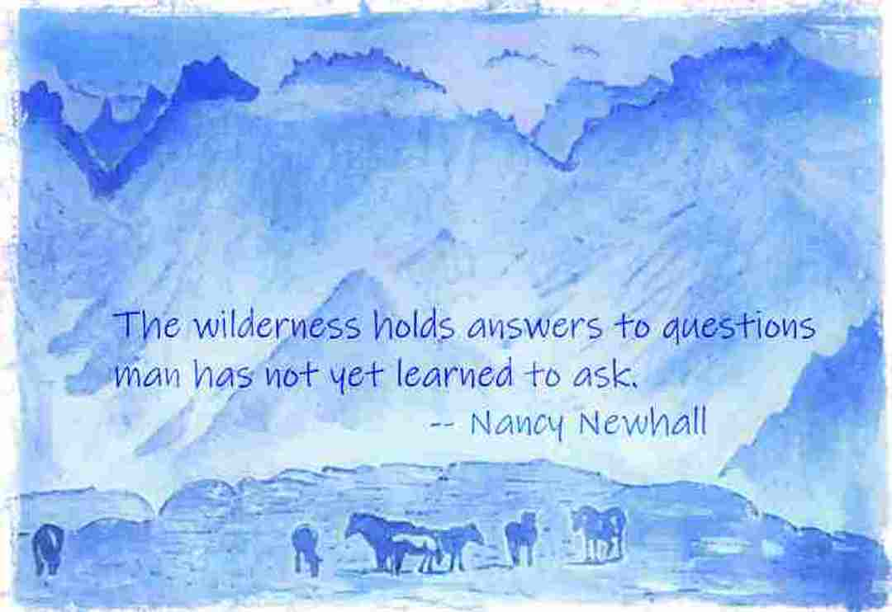

<!--- [comment]: <> (This is a comment, it will not be included) --->
## *Welcome to (Gipsi's) GitHub Pages
 
You can use the [editor on GitHub](https://github.com/gipsi/gipsi.github.io/edit/master/README.md) to maintain and preview the content for your website in Markdown files.

Whenever you commit to this repository, GitHub Pages will run [Jekyll](https://jekyllrb.com/) to rebuild the pages in your site, from the content in your Markdown files.

### Markdown

Markdown is a lightweight and easy-to-use syntax for styling your writing. It includes conventions for

```markdown
Syntax highlighted code block

# Header 1
## Header 2
### Header 3

- Bulleted
- List

1. Numbered
2. List

**Bold** and _Italic_ and `Code` text

[Link](url) and 

```

For more details see [GitHub Flavored Markdown](https://guides.github.com/features/mastering-markdown/).

### Jekyll Themes

Your Pages site will use the layout and styles from the Jekyll theme you have selected in your [repository settings](https://github.com/gipsi/gipsi.github.io/settings). The name of this theme is saved in the Jekyll `_config.yml` configuration file.

### Support or Contact

Having trouble with Pages? Check out our [documentation](https://help.github.com/categories/github-pages-basics/) or [contact support](https://github.com/contact) and we’ll help you sort it out.

<!--
> 

Links: to [@codewisdom](https://twitter.com/CodeWisdom) on Twitter, and about
[Nicholas Negroponte](https://en.wikipedia.org/wiki/Nicholas_Negroponte) at Wikipedia.

-->


# A blog about learning to code

> I think when you have a lot of jumbled up ideas they come together slowly over a period of several years ~ [Tim Berners-Lee](https://en.wikipedia.org/wiki/Tim_Berners-Lee)

## #[100DaysofCode Journal](100daysofcodelog.md) - Restart - Round Five

**[@gipsitana on Twitter](https://twitter.com/gipsitana)** 

## HTML/CSS/JavaScript ... and Python

Web Development


> "There is no problem so bad that you can't make it worse." [Chris Hadfield](https://www.youtube.com/watch?v=GplXBlTNO4A)


## Error messages are my friends


## #100daysofCode R5D5
## #1mwtt #SummerofCode  D5

Carefuly went through what I learned in this weeks lessons and wrote some python code:
```
  name1 = input('Enter your first name: ')
  name2 = input('Enter your middle name: ')
  name3 = input('Enter your last name: ')
  print('Hello', name1 + ' ' + name2 + ' ' + name3)
```
```
  bestnumber = input('Enter your favourite number: ')
  print('Perhaps a better number is?', int(bestnumber) + 1)
```
Started using the interpreter ```>>>``` as well as ```print()``` from file

## #100daysofCode R5D4
Made css-grid repo for watercolour painting challenge.
[waterpaint2018](https://gipsi.github.io/waterpaint2018/)
## #1mwtt #SummerofCode  D4
Revisiting some of [Learn to program](https://pine.fm/LearnToProgram/chap_00.html) by Chris Pine
and the sweetness of some #python [syntactic sugar](https://en.wikipedia.org/wiki/Syntactic_sugar).

## #100daysofCode R5D3
## #1mwtt #SummerofCode  D3 

Loops and arrays, if and sorted.

The year 2038 problem

Arithmetical calculations, integer overflow and the end of time. 

A new GitHub repo for my Summer of Code DIY notes.

Discord yay!

Practicing ```python calc.py``` in the command line. 

Gamification for non-profits.

## #100daysofCode R5D2
## #1mwtt #SummerofCode  D2
Watched Video lecture about combining strings and numbers, assigning values to variables


 
## #100daysofCode R5D1
## #1mwtt #SummerofCode  D1

I took summer break when I got to halfway through round 5 day 50ish of coding every day and have been focussing on making art.  Digital images with an Android phone camera, photo editor, Pixl andr Pixabay through May and June and watercolour painting in July.  I post the stuff I do on [Instagram](https://www.instagram.com/gipsitana/).

## CNC2018 Code More

I've been structuring the way I think about coding, planning a website with the second CodeNewbie challenge this year.
I've started a plan with an html document in Notepad++.  Yesterday I started learning Trello boards.

> "The hardest part of coding more isn’t the coding — it’s finding a system and structure that fits into your busy life. We’ll help you set goals, create a roadmap, find a schedule, and, most importantly, hold you accountable to reaching your coding goals."

## One million women to tech - DIY track

I missed the onboarding during a sultry heatwave World Cup weekend but managed to navigate through Facebook groups, Twitter, Youtube and emails to watch a replay of the webinar.  Inspired I caught up with the first weeks lessons by Tuesday night. So here I am Wednesday afternoon feeling chuffed at getting Python to do a calculation on my laptop in Powershell!  


The transcript of the lessons here on GitHub is great but I did get stuck when python wasn't recognised in Powershell or the Windows basic command prompt.  After some unfruitful Python help pages and stackoverflow searching I skipped ahead to [Learn Python the HardWay](https://learnpythonthehardway.org/python3/ex0.html) which I know has thorough installation guide for newbs. Indeed I had to uninstall and start again, this time checking the PATH box which I'd left unchecked. Cool! Python was summoned in the shell. However my calc.py file still didn't work. This time the [Python FAQ's](https://docs.python.org/3/faq/windows.html) helped and I sorted out the file address.  I moved the py-programs and web-projects folders from the desktop to the users folder and cd'd to py-programs.

Note! The prompt ruby is a nice little tip about lessons origins of [Learn to program](https://pine.fm/LearnToProgram/) adapted for Python from Ruby. 


