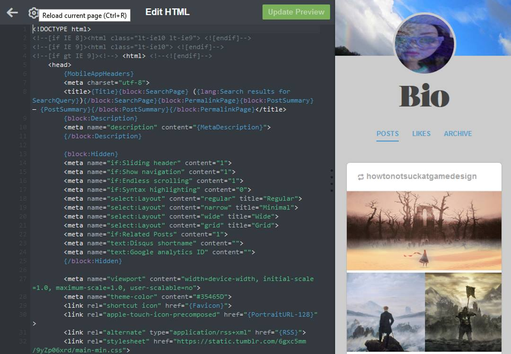
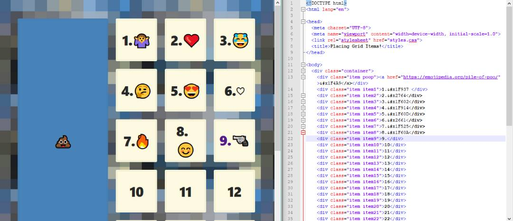
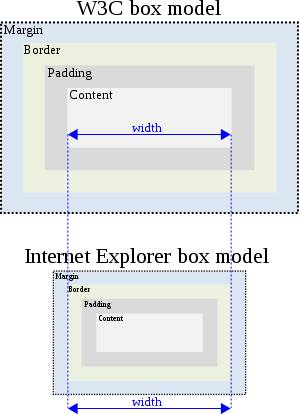
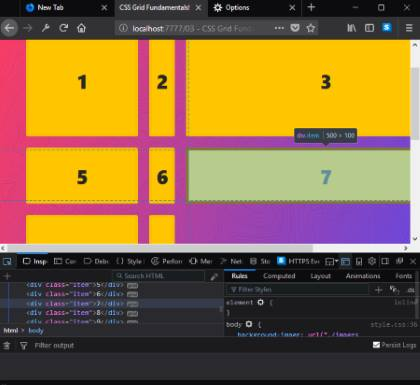

# A Blog about learning to code

**[@gipsitana on Twitter](https://twitter.com/gipsitana)** 

## HTML/CSS/JavaScript

_Frontend Web Development_

A Blog about learning to code

HTML/CSS/JavaScript

> "There is no problem so bad that you can't make it worse." [Chris Hadfield](https://www.youtube.com/watch?v=GplXBlTNO4A)
 
### Day 20 March 27th

More than an hour fixing the volume button on the taskbar of Windows 10.  The button was there but doing nothing.  Quite a few suggestions I visited started with right click on the button but this didn't work either.

Eventually this [Windows 10 skills](https://windows10skill.com/windows-10-volume-control-is-not-working/) site had the solution:  Change Audio Services, which was basically switch the audio manager off then on again and reboot.


So I was wondering if I could add a YouTube video to this page.  No, but I can link to one with an image like this:

```
<a href="http://www.youtube.com/watch?feature=player_embedded&v=YOUTUBE_VIDEO_ID_HERE
" target="_blank"></a>
```


I watched this [DevTips video](https://www.youtube.com/watch?v=hExwnLlj2xk&index=44&list=PL940Wy-AWgfaSihpsvZ3rSkvS0Djs00FY&t=0s) about making a splash page yesterday and had planned to make one myself today.  Tried code from link on CodePen but it didn't work.  The syntax wasn't complete, I tried filling it in but gave up as IDK [SASS](http://sass-lang.com/) (or [LESS](http://lesscss.org/))! ... just yet.

Brad Traversy put the code for a [full screen landing page](https://codepen.io/bradtraversy/pen/XerXYV)  on CodePen so I used that instead.  

I also looked at his site to check out some video tutorials at        [ ](http://www.traversymedia.com/#page-top)

Linked to another site called [EduOnix](https://www.eduonix.com/) where I started a short video tutorial on making an[HTML5 distance meter](https://www.eduonix.com/courses/Web-Development/Learn-HTML5-Distance-Meter) I watched about a third then needed to switch to reading about [XAMMP](https://en.wikipedia.org/wiki/XAMPP) a [free and open source](https://en.wikipedia.org/wiki/Free_software) [cross-platform](https://en.wikipedia.org/wiki/Cross-platform) [web server](https://en.wikipedia.org/wiki/Web_server) [solution stack](https://en.wikipedia.org/wiki/Solution_stack) package developed by Apache Friends.


Back to the landing page.  I like to use [web safe colors](https://html-color-codes.info/web-safe-colors/) as often using color-picker chosen ones doesn't work.  The [HTML Color Names](https://html-color-codes.info/color-names/) has more choice though and I used the hex for lavender E6E6FA for the title.

[Bio splash landing](https://gipsi.github.io/bio/#)


### Day 19 March 26th

I set up  new blog on Blogger for creative writing and called it [Bio](https://gipsitana.blogspot.co.uk/2018/). 

Importing the writing I'd put a Google Docs template  into Blogger and editing the HTML there went OK. Although the copious amounts of code in a great block  in the head tag was a surprise (there are widows and orphans in there too 😮) . I did proceed and edit in HTML.  It took a bit of fiddling about to get the title photo in the right place.  The backgound photo of the blog looked alright to begin with on the laptop. only later on the phone I noticed the picture repeating, that wont do! 


Learnt some basic use of google analytics watching their tutorial videos then installed it by adding a script tag they gave me to paste in.  Now it's all about learning how to read and use the analytics software.

The code looks quite different.  Much easier to read in the browser with 'view source'.

 


### Day 18 March 25th

#### [The Absolute Minimum Every Software Developer Absolutely, Positively Must Know About Unicode and Character Sets (No Excuses!)](https://www.joelonsoftware.com/2003/10/08/the-absolute-minimum-every-software-developer-absolutely-positively-must-know-about-unicode-and-character-sets-no-excuses/)

Emoji homework! ... on unicode and character sets.


### Day 17 March 24th

Whilst exploring tumblr I found you can edit the html.




### Day 16 March 23rd

I made an [emojigrid](https://gipsi.github.io/emojigrid/) GitHub repo last night but fogot how to set the url for it.

Sorted that out: go to settings>scroll down to gh-pages section>publish default is **None**, change that to Master or gh-pages.

Filled in the most popular from a list on [emojipedia](https://emojipedia.org/). Then used the randomise button and picking ones I like.  

Found out you can change the skin colour of people emojis. 🧜🏿‍♂️ .  The code for that in HTML is 

```&#x1F9DC&#x1F3FF``` This is  the two code point numbers that represents the emoji plus a modifier in Unicode with  the prefix U+ changed to a character escape &#x.  Some more on [character escapes in css and markup](https://www.w3.org/International/questions/qa-escapes)

Emoji modifiers were added based on the [Fitzpatrick scale](https://en.wikipedia.org/wiki/Fitzpatrick_scale) of skin tones in 2015.

I made a CodePen pen too: [CSS Grid Playground - placing items        ](https://codepen.io/gipsi/pen/BrZGRP)


Using [Typora](https://typora.io/) for Markdown - Lovely to use now I'm getting the hang of it.


### Day 15 March 22nd

Practicing what I learnt yesterday by placing emoji items in CSS Grid boxes.



### Day 13/14 March 20th/21st

#### How I put a poop emoji in my  HTML

Here's a comprehensive [encyclopedia of emoji! 😀](https://emojipedia.org/)

Hello 💩 

Well that was easy!  No not really. This is Markdown and copy paste is working fine.  Not so in HTML Markup.

Do I want an [emoji domain name?](https://blog.farrant.me/getting-an-emoji-domain-in-2015/)

Actually no, that was interesting but a distraction.  I want to put emoji's in CSS Grid boxes in an HTML5 document.

Ah!  This looks helpful. [How to Insert Emojis in HTML](https://linuxwebdevelopment.com/how-to-insert-emojis-in-html/)

And another [emoji list ](https://unicode.org/emoji/charts/full-emoji-list.html)

I'll try  a [unicorn face](https://emojipedia.org/unicorn-face/) 

Get to the the [code point](https://codepoints.net/).

U+1F984

Change it to this.

&#1F984;

Nope that doesn't work.

[Handling character encodings in HTML and CSS (tutorial)](https://www.w3.org/International/tutorials/tutorial-char-enc/) 

 [In a nutshell](https://www.w3.org/International/tutorials/tutorial-char-enc/#quicksummary)

Save your pages as UTF-8.  Yep did that right from the start.

How about  W3School - try an [HTML5 entity](https://www.w3schools.com/charsets/ref_html_entities_u.asp).  

**uhblack - a black box** &uhblk; alt="waving black flag" 🏴

Yep that works with this code: ```&#9600;```, or this, ```&#x2580;```, or this, ```&uhblk;```.

But I don't really want an **entity** I want an **emoji**.😒 


Sooo, back to the [pile of poo.](https://emojipedia.org/pile-of-poo/)

OK some [history of the poop emoji](https://www.fastcompany.com/3037803/the-oral-history-of-the-poop-emoji-or-how-google-brought-poop-to-america) and stuff about [code points](https://codepoints.net/U+1F4A9.)

When I copy and paste the emoji code point code it just transfers a two question marks, like this:``` <div class="item item10">??</div>``` which then both appear in my CSS Grid box. No emoji.


But there is an [Embed this codepoint] button.  A pop up box appears.

> Embed this codepoint in your own website by simply copy-and-pasting the following HTML snippet:

```
<iframe src="https://codepoints.net/U+1F984?embed"
        style="width: 200px; height: 26px;
        border: 1px solid #444;">
</iframe>
```

> If you want, you can freely change width and height to meet your needs. The layout will adapt accordingly.


This is alright, I have got the unicorn face, but also the code point and the name of the emoji written beside it.  I'd really rather just have the emoji.

Looking at the iframe code and wondering how to ditch the surplus info went to the codepoints link in the code. [This unicorn page](https://codepoints.net/U+1F984?embed)  has at the bottom an [HTML-Escape code](https://www.w3.org/International/questions/qa-escapes ), same as the one I tried earlier but with an x ```&#x1F984;```  It works! 🦄


### Day 11/12 March 18th/19th - CSS Grid

#### Notes on: Naming Lines, Block Fitting and Centering 

For horizontal scrolling: grid-auto-flow: column;


#### Naming Lines

(Doesn't show up in dev tools yet)

The lines between the boxes can be named by putting the names inside square brackets in front of the value of the boxes, e.g.
```
.container {
  display: grid;
  grid-gap: 20px;
  grid-template-columns: [site-left] 1fr [content-start] 500 px [content-end] 1fr [site-right];
  /* Can be multiple names too: grid-template-columns: [sidebar-start site-left] 1fr [sidebar-end content-start] 500 px [content-end] 1fr [site-right]; */
  grid-template-rows; [content-top] repeat(10, auto) [content-bottom];

.item3 {
  background: slateblue;
  grid-column: content-start;
  grid-row: content-top / content-bottom;
```


#### Block fitting 

grid-auto-flow: dense;

An alternative for the grid-autoflow property. 

If the order of different size boxes is not too important this is useful for filling the page without leaving holes or gaps.
```
.container {
  display: grid;
  grid-gap: 20px;
  grid-template-columns: repeat(10, 1fr);
  grid-auto-flow: dense;
}

.item:nth-child(6n) {
  background: cornflowerblue;
  grid-column: span 6;
}

.item:nthchild(8n) {
  background: tomato;
  grid-column: span 2;
}

.item:nth-child(9n) {
  grid-row: span 2;
}

.item18 {
  background: greenyellow !important; /* Have to have the !important because nth-child is more specific than the item number. */
/* Then if you want to anchor this item at the end */
  grid-column-end: -1 !important;
```
For horizontal scrolling: grid-auto-flow: column;


#### Centering

6 items come with justify:

(justify = row axis
align = column axis)

justify-items:
align-items:

justify-content:
align-content:

align-self:
justify-self:

For reference see:
CSS-TRICKS [A Complete Guide to Grid](https://css-tricks.com/snippets/css/complete-guide-grid/)

### Day 9/10 March 16th/17th 2018 - CSS grid template area and Poop Emoji

Stuck on how to put emoji into html.

### Day 8 March 15th 2018 - CSS grid Responsive by default (no more media queries?) 

#### auto-fit, auto-fill and minmax().

```
 .container {
      display: grid;
      grid-gap: 20px;
      border: 10px solid var(--yellow);
      grid-template-columns: repeat(auto-fill, minmax(150px, 1fr));
```
- [Wes Bos ](http://wesbos.com/) [CSS GRID](https://cssgrid.io/)
- [Smashing Magazine Using Media Queries For Responsive Design In 2018](https://www.smashingmagazine.com/2018/02/media-queries-responsive-design-2018/)
- [Smashing Magazine Understanding CSS Layout And The Block Formatting Context](https://www.smashingmagazine.com/2017/12/understanding-css-layout-block-formatting-context/)


### Day 7 March 14th 2018 - CSS grid workout

#### Sizing tracks, repeat function, sizing and placing items

``` 
    .container {
      display: grid;
      grid-gap: 20px;
      /* Make the grid 10 columns wide, every other taking up twice the free space */
      grid-template-columns: repeat(5, 1fr 2fr);
      /* Make the grid have 10 explicit rows, 50px high each */
      grid-template-rows: repeat(10, 50);
    }

    /* With Item 1, start at col 3 and go until 5 */
    .item1 {
      grid-column: 3 / 5;
    }

    /* With Item 2, start at col 5 and go until the end */
    .item2 {
      grid-column: 5 / -1;
    }

    /* Make Item 5 double span 2 cols and rows */
    .item5 {
      grid-column:  span 2;
      grid-row:  span 2;
    }

    /* Make Item 8 two rows high */
    .item8 {
      grid-row:  span 2;
    }

    /* Make Item 15 span the entire grid width */
    .item15 {
      grid-column:  1 / -1;
    }

    /* Make item 18 span 4 widths, but end 9 */
    item18 {
      grid-column: span 4 / 9;
    }

    /* Make item 20 start at row 4 and go for 3 */
    .item20 {
      grid-row:  4 / span 3;
    }
```

 [Wes Bos ](http://wesbos.com/) [CSS GRID](https://cssgrid.io/)
 

### Day 6 March 13th 2018 - CSS grid-auto-flow, Fractional Unit (free space) and "The Curse of Knowledge".

#### grid-auto-flow

By default CSS grid places items in rows, with auto-flow this can be changed to columns for horizontal scrolling.

```
    .container {
      display: grid;
      grid-gap: 20px;
      grid-template-columns: 400px 200px;
      grid-auto-flow: column;
      grid-auto-columns: 200px;
    }
```

#### Fractional Unit (free space)

In CSS Grid fr = fractional unit = (free space!) represents the amount of space left after all the elements are laid out. 

```   
   .container {
      display: grid;
      grid-gap: 20px;
      border: 10px solid var(--yellow);
      grid-template-columns: 1fr 1fr 1fr 1fr;
     

    }
```

#### The Curse of Knowledge

[Adactio](https://adactio.com/journal/13521) on "[the curse of Knowledge](https://en.wikipedia.org/wiki/Curse_of_knowledge)" and why it's  a good idea to blog about stuff when you're learning.

#### Fact and Fiction 

An exercise in [writing](https://docs.google.com/document/d/1Sv50x-1YjEL43rOpk_nJTaEsZ1YM0JmBpUlbyJE2DDk/edit?usp=drivesdki) for the Futurelearn Course [Start Writing Fiction](https://www.futurelearn.com/courses/start-writing-fiction).

### Day 5 March 12th 2018 - Talks over Coffee

#### Heartfelt dev talks for humans

Is a [Glitch.com remix](https://glitch.com/) a collection of videos. 

- Watching: [I Have No Idea What The Hell I'm Doing](https://coffee-talks.glitch.me/)  by Brad Frost

- Reading: 
    - [The Little Book of HTML/CSS Coding Guidelines](http://www.oreilly.com/web-platform/free/little-book-html-css-coding-guidelines.csp?download=true) by Jens Oliver Meiert on writing code for humans.

    - [The V6 Blog Archive of Rob Weychert](http://v6.robweychert.com/blog/2017/09/v6-the-archive/) on the ephemeral nature of third party services.

- Learning: [Transmedia Storytelling with FutureLearn](https://www.futurelearn.com/courses/transmedia-storytelling) Transition in common usage from the term narrative to storytelling in the 1990s. The basic elements of background, character and plot.

### Day 4 March 11th 2018 - box-sizing

#### The CSS property with its own day.

On 1st February 2014 Chris Coyer of CSS Tricks declared  [**International box-sizing Awareness Day**.](https://css-tricks.com/international-box-sizing-awareness-day/) 

>In honor of, you guessed it, the most humble and undersung, yet awesome and useful CSS property: [box-sizing.](https://css-tricks.com/almanac/properties/b/box-sizing/) ~ Chris Coyer

The origin of the concept being a post by Paul Irish on 1st February 2012 
[* { Box-sizing: Border-box }FTW](https://www.paulirish.com/2012/box-sizing-border-box-ftw/)

There's a [fascinating history](https://css-tricks.com/box-sizing/) and it's interesting to discover how width has been interpreted differently between the W3C and Internet Explorer.

#### The Box Model



#### Introduction to Modern Web Technologies

[Lea Verou](http://lea.verou.me/2018/02/free-intro-to-web-development-slides-with-demos/) has shared the slides from her MIT labs introducing students to Web development technologies. A great set of slides plus  useful resource selection to go with them.  Lots more good stuff on her wonderfully absorbing Website too.

#### CSS Grid Dev-tools and Implicit vs Explicit Tracks

Two more of Wes Bos [CSS GRID](https://cssgrid.io/) videos.  I'm getting the hang of using npm through Powershell for ```browser-sync```.  Quite a bit of shuffling windows around the desktop and rearranging the dev tools panes, resizing things.

Outlining and changing the colour the lines around items in _web developer>inspector_.  Dotted lines surround implicit tracks, which are like the default ones and dashed lines border explicit tracks which are defined by you in the code.

### Day 3 March 10th 2018 -  Fun with CSS Grid Fundamentals

Second day of the [Wes Bos ](http://wesbos.com/) [CSS GRID](https://cssgrid.io/) course dives right into making and sizing grid items.




This piece of code demonstrates how ```display: grid;```  works on all the container items,  
```grid-template-columns: 200px 500px;``` and ```grid-template-rows: 200px 100px 400px;``` explicitly sizes the items and 
```grid-gap: 20px;``` sets the tracks, which are like margins between the items.
   

```
    .container {
      display: grid;
      grid-template-columns: 200px auto 500px 50px;
      grid-template-rows: 200px 100px 400px;
      grid-gap: 20px;
    }
``` 
  
The ```auto``` keyword made things fluid and the values are pixels or rems rather than percentages as the new ```fr``` value is going to be introduced instead later on.

### Not everything has to be square!

Sometimes it seems like everything on the Web is a box - it doesn't have to be.

>Use the Clip Path property to alter elements in your layouts to be polygons, circles, triangles, and more. ~ Jen Simmons

In this great video  [Jen Simmons](https://www.youtube.com/watch?v=3kncTIpc4Q4) explains.  There's a whole bunch more about layout on her YouTube Channel [Layout Land](https://www.youtube.com/channel/UC7TizprGknbDalbHplROtag) - just what I need right now.


### Day 2 March 9th 2018 - Griddy Up

After a quick review of last year's coding efforts I decided that I need to improve my CSS skills.  So today I started  
[CSS GRID](https://cssgrid.io/) the 25 video free course by [Wes Bos ](http://wesbos.com/).

>Wes, How is this Free!? What's the Catch?

>No catch! A huge thanks to Mozilla Firefox who has sponsored my time to create this course and offer it up for free. Firefox packs >some of the best dev tools and in particular their CSS Grid Dev tools make understanding, debugging and visualizing complex grid >layouts a snap.

### Starter Files and Tooling Setup

After the welcome video the first tutorial is only a little over 10 minutes, but there is a lot to do!
- Install Firefox Quantum: Developer Edition
- Download and install Node.js
- Download starter files from GitHub
- Download and install VS Code

I already have the Firefox Quantum Developer Browser but I did need to install Node.js.  I followed along with the video pausing it to get through each of the steps required to complete the setup.  I used Windows Powershell to check for the Node.js installation. Next was downloading the starter files from GitHub, I also forked the repo, noting that I should take care not to do a pull request. 

I got VS code up and running and read the opened JSON lock file.  Although this seemed a bit obscure to start with the reason is to have the```"browser-sync"``` tool update the results of coding in the browser without refreshing.

The next part was to look at the start file package in Powershell by copy pasting it into the root and then ```npm i``` which installed the dependency  ```"browser-sync"```.

```npm start``` then opened a page of the files to work with in the browser.

- A nice basic html skeleton file.
With a demonstration of how adjustments automatically refresh.
- An explanatory recommendation and demonstration of Emmet.
```container.item*10``` is a useful snippet. Hit tab = ten divs.
- A run through of the basic CSS stylesheet no CSS Grid here yet.
- ```var(--color)```from ```:root``` top of stylesheet
- Google ```"box-sizing: border-box;"``` 

Loads of tips and snippets in a short video so I'm happy.  Everything worked not exactly straight away but eventually so looking forward to tomorrow.


                                                                                                                  
### Day 1 March 8th 2018 - Mastering Markdown

Last year I coded every day, nearly four rounds of one hundred days of code. As well as tweeting my progress I followed tutorials, got stuck, found answers, read manuals, read code, read blogs, signed up for email newsletters, did MOOCs ... and made this 
website of my own [gipsi.itbit.me blog](http://gipsi.itbit.me).

Today I'm reviewing what I did, tinkering a bit, fixing broken links and setting up some new things for a another round of [#100DaysOfCode](http://www.100daysofcode.com/).

I'm participating in the CodeNewbie Challenge [**Start Coding** #CNC2018](http://2018.codenewbie.org/) which is encouraging me to think more clearly about and be more specific with my coding goals.

### Day 1 February 1st 2018 - delayed start

Partly due to working on:
- Learning about [Biodiversity and Global Change: Science & Action](https://www.class-central.com/course/coursera-biodiversity-and-global-change-science-action-7793) and creative writing [The Craft of Plot](https://www.class-central.com/course/coursera-creative-writing-the-craft-of-plot-5625).
- Setting up the tools for [Creative Programming for Digital Media & Mobile Apps](https://www.mooc-list.com/course/creative-programming-digital-media-mobile-apps-coursera).
- "Doing the Opposite" [#100DaysOfVolunteering](gipsi.github.io/snowtrees_20180227.jpg) as a thing after thinking about [#100DaysOfX](http://www.100daysofx.com/).
- A MOOC about mental health and wellbeing [Psychology and Mental Health: Beyond Nature and Nurture](https://www.futurelearn.com/courses/mental-health-and-well-being).

 _*I am developing this coding blog from a template and intend to keep the following section here for reference:_

## *Welcome to GitHub Pages
 
You can use the [editor on GitHub](https://github.com/gipsi/gipsi.github.io/edit/master/README.md) to maintain and preview the content for your website in Markdown files.

Whenever you commit to this repository, GitHub Pages will run [Jekyll](https://jekyllrb.com/) to rebuild the pages in your site, from the content in your Markdown files.

### Markdown

Markdown is a lightweight and easy-to-use syntax for styling your writing. It includes conventions for

```markdown
Syntax highlighted code block

# Header 1
## Header 2
### Header 3

- Bulleted
- List

1. Numbered
2. List

**Bold** and _Italic_ and `Code` text

[Link](url) and 
```

For more details see [GitHub Flavored Markdown](https://guides.github.com/features/mastering-markdown/).

### Jekyll Themes

Your Pages site will use the layout and styles from the Jekyll theme you have selected in your [repository settings](https://github.com/gipsi/gipsi.github.io/settings). The name of this theme is saved in the Jekyll `_config.yml` configuration file.

### Support or Contact

Having trouble with Pages? Check out our [documentation](https://help.github.com/categories/github-pages-basics/) or [contact support](https://github.com/contact) and we’ll help you sort it out.

