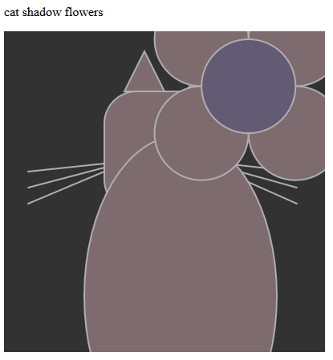
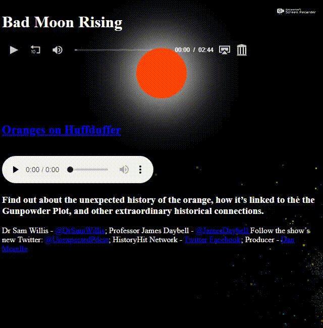

<!--- [comment]: <> (This is a comment, it will not be included) --->
<!---
> "There is no problem so bad that you can't make it worse." [Chris Hadfield](https://www.youtube.com/watch?v=GplXBlTNO4A)
--->
[#codevember repo](https://gipsi.github.io/codevember/)

  

  #Codevember 09 green-tree generator

  

  #Codevember 08 cat shadow flowers

  

  #Codevember 07 sea pigment waves

  

  #Codevember 06 web-dune generation

  

  #Codevember 05 eclipse-music-rise

  

  #Codevember 04 sky-fragment bird

  

  #Codevember 03 Carrot-reflect heart

  

  #Codevember 02 Time-coral clock

  

  #Codevember 01 Infinity-light cube

# A blog about learning to code

<!--- > I think when you have a lot of jumbled up ideas they come together slowly over a period of several years ~ [Tim Berners-Lee](https://en.wikipedia.org/wiki/Tim_Berners-Lee) --->
<!---
> "The amateur software engineer is always in search of magic." - Grady Booch
> via Programming Wisdom @CodeWisdom on Twitter 12:37 PM - 12 Oct 2018 
--->
## *Welcome to (Gipsi's) GitHub Pages

For this round of 100Daysofcode I started making a new website - I plan to do something each day with what I've learnt so far and as I learn new things. 
I'm curious about what it will become! [Up to Code](https://gipsi.neocities.org/)


---
### stuff explaining this site
 
You can use the [editor on GitHub](https://github.com/gipsi/gipsi.github.io/edit/master/README.md) to maintain and preview the content for your website in Markdown files.

Whenever you commit to this repository, GitHub Pages will run [Jekyll](https://jekyllrb.com/) to rebuild the pages in your site, from the content in your Markdown files.

### Markdown

Markdown is a lightweight and easy-to-use syntax for styling your writing. It includes conventions for

```markdown
Syntax highlighted code block

# Header 1
## Header 2
### Header 3

- Bulleted
- List

1. Numbered
2. List

**Bold** and _Italic_ and `Code` text

[Link](url) and 

```

For more details see [GitHub Flavored Markdown](https://guides.github.com/features/mastering-markdown/).

### Jekyll Themes

Your Pages site will use the layout and styles from the Jekyll theme you have selected in your [repository settings](https://github.com/gipsi/gipsi.github.io/settings). The name of this theme is saved in the Jekyll `_config.yml` configuration file.

### Support or Contact

Having trouble with Pages? Check out our [documentation](https://help.github.com/categories/github-pages-basics/) or [contact support](https://github.com/contact) and we’ll help you sort it out.

<!--
> 

Links: to [@codewisdom](https://twitter.com/CodeWisdom) on Twitter, and about
[Nicholas Negroponte](https://en.wikipedia.org/wiki/Nicholas_Negroponte) at Wikipedia.

-->

