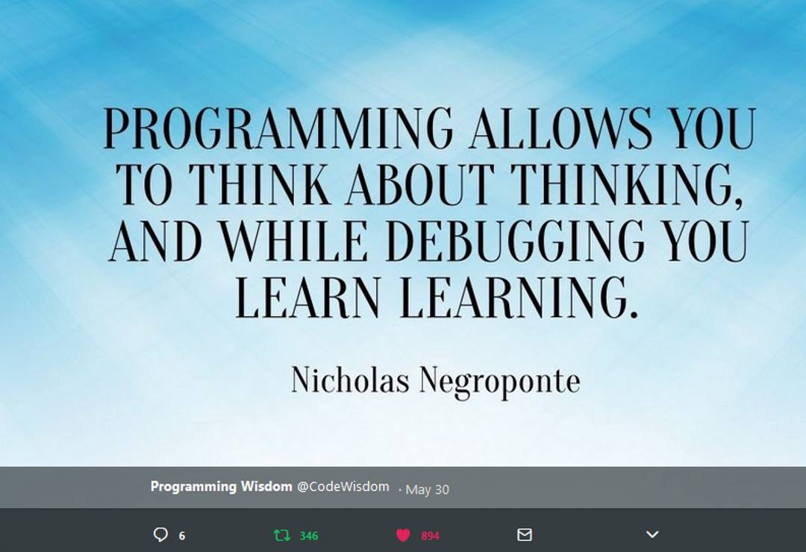
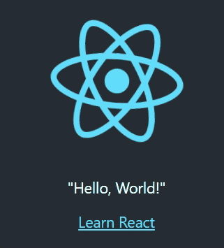
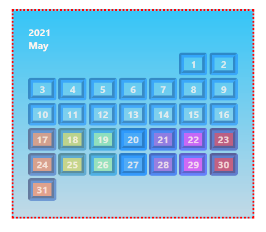

<!--- [comment]: <> (This is a comment, it will not be included) --->


# 2022 JavaScript Journal


## "If I waited for perfection... I would never write a word." ~ Margaret Attwood

---

## 06 06 2022 ~ Monday

## Be the browser’s mentor, not its micromanager.
### How to build exellent websites. by Andy Bell
CSS practice [Glitch remix](https://lackadaisical-fifth-split.glitch.me/)

 
---
## 30 05 2022 ~ Monday

## BBC's Global Experience language GEL
### Design pattern how-to's.
Understanding users.

7 principles to help create great digital experiences for children.  
How to [design for children](https://www.bbc.co.uk/gel/guidelines/how-to-design-for-children-2)

---

## 09 05 2022 ~ Monday

CSS grid calendar.

Some basic boxes: [calendargrid](cssgrid/calendargrid/index.html)

---

## 02 05 2022 ~ Monday

Why is front end development so hard?

Useful answer to the question: [quora](https://qr.ae/pvYR0G)

---

## 13 03 2022 ~ Monday [clock](https://gipsi.netlify.app/)

---
## 08 03 2022 ~ Tuesday
Proceeding to set up an [11ty](https://www.11ty.dev/docs/getting-started/) site. Started: 14:00 UK winter time.
By 18:40 the shiny new site said Hi! Browsersync serving the index.html file and README.md from: _site. Woohoo localhost:8080! The command line instuction to make the html file hadn't worked kept giving '< was unexpected at this time' error, so made the file in VS code in the browser instead.
Rest of the evening figuring what to do next.. perused lots of [starter projects](https://www.11ty.dev/docs/starter/), reasons for using a [styleguide](https://www.zachleat.com/web/now-with-style-guide/), and a [poem](https://www.tatianamac.com/poetry/call-of-crows/).

And then, some [Sanity](https://www.sanity.io/).


---
## 29 02 2022 ~  ! Not secure [Flora](http://www.encyclopediaofukraine.com/display.asp?linkpath=pagesFLFlora.htm) 🇺🇦

---
## 22 02 2022 ~ Tuesday
Found an online book and read some reminders of reasons to Learn JavaScript [w3docs](https://www.w3docs.com/learn-javascript.html)

" There are at least three perfect things about JavaScript:

1. It supports complete integration with CSS and HTML.
2. It provides straightforward ways of doing simple things.
3. It is supported by almost all the major browsers and is performed by default. "
---
### Resources:

#### MDN [JavaScript](https://developer.mozilla.org/en-US/docs/Web/javascript)
#### Frontend Masters [Bootcamp](https://frontendmasters.com/dashboard/)
#### FreeCodeCamp [JavaScript Algorithms and Data Structures](https://www.freecodecamp.org/learn/javascript-algorithms-and-data-structures/)
#### w3docs [Learn JavaScript](https://www.w3docs.com/learn-javascript.html)
#### Digital Ocean [How To Code in JavaScript](https://www.digitalocean.com/community/tutorial_series/how-to-code-in-javascript)
#### W3schools [JavaScript Tutorial](https://www.w3schools.com/js/DEFAULT.asp)

 > I think when you have a lot of jumbled up ideas they come together slowly over a period of several years ~ [Tim Berners-Lee](https://en.wikipedia.org/wiki/Tim_Berners-Lee) 

---
# Welcome to GitHub Pages

<!--
> "The amateur software engineer is always in search of magic." - Grady Booch
> via Programming Wisdom @CodeWisdom on Twitter 12:37 PM - 12 Oct 2018 
-->

### How this site works

You can use the [editor on GitHub](https://github.com/gipsi/gipsi.github.io/edit/master/README.md) to maintain and preview content for the website in Markdown files.

Whenever you commit to this repository, GitHub Pages will run [Jekyll](https://jekyllrb.com/) to rebuild the pages in your site, from the content in your Markdown files.

### Markdown

Markdown is a lightweight and easy-to-use syntax for styling your writing. It includes conventions for

```markdown
Syntax highlighted code block

# Header 1
## Header 2
### Header 3

- Bulleted
- List

1. Numbered
2. List

**Bold** and _Italic_ and `Code` text

[Link](url) and 

```

For more details see [GitHub Flavored Markdown](https://guides.github.com/features/mastering-markdown/).

### Jekyll Themes

Your Pages site will use the layout and styles from the Jekyll theme you have selected in your [repository settings](https://github.com/gipsi/gipsi.github.io/settings). The name of this theme is saved in the Jekyll `_config.yml` configuration file.

### Support or Contact

Having trouble with Pages? Check out our [documentation](https://help.github.com/categories/github-pages-basics/) or [contact support](https://github.com/contact) and we’ll help you sort it out.

<!--
> 

Links: to [@codewisdom](https://twitter.com/CodeWisdom) on Twitter, and about
[Nicholas Negroponte](https://en.wikipedia.org/wiki/Nicholas_Negroponte) at Wikipedia.

-->

---

---
# 2021 Archive (HTML and CSS)
#  When I publicly committed to another #100DaysofCode
## Where your focus goes your energy flows. 🦋 🐛   


### From Monday 17th May 2021 to Tuesday 24th August 2021
#### #100DaysofCode  @ka11away's [Official Site](https://www.100daysofcode.com/)
#### #30DaysofHTML Learning with Jen [email course](https://learnwithjen.com/#zEosF)
#### #150DaysofHTML Deep dive with Schalk Neethling [email course](https://150daysofhtml.substack.com/about)
#### Frontend Masters [Bootcamp](https://frontendmasters.github.io/bootcamp/)
#### Udacity [Classroom](https://frontendmasters.github.io/bootcamp/)


##### A live [calendar for June](https://gipsi.github.io/calendar/)
---

### June 22nd 2021 
### Day 36 - A bit of Git - #100DaysOfCode 

A deeper dive and rummage into  Git concepts prompted by this thread ...

<blockquote class="twitter-tweet"><p lang="en" dir="ltr">The most important GIT CONCEPTS <br><br>Stop copy-pasting, start Understanding <br><br>- THREAD -</p>&mdash; Iren Gataullina (@IrenSayWhen) <a href="https://twitter.com/IrenSayWhen/status/1404427336909471744?ref_src=twsrc%5Etfw">June 14, 2021</a></blockquote> <script async src="https://platform.twitter.com/widgets.js" charset="utf-8"></script>

### June 21st 2021  
### Day 35 - HTML challenge - #100DaysofCode

Had a second try at this challenge using lots of < abbr> and < dfn> tags.  
Rather more than would usually be neccessary as clarified by helpful feedback from Jen Kramer:  
> < abbr> is for abbreviations, acronyms, and initialisms. Let's say we're talking about HTML. All the <abbr> element tells us is what HTML stands for:

> < abbr title="Hypertext Markup Language">HTML< /abbr>

> < dfn> does the definition. Often that goes beyond the abbreviation (hopefully!):

>  < p>< dfn id="html">< abbr title="Hypertext Markup Language">HTML< /abbr>, the Hypertext Markup Language,</dfn> describes the structure of web documents, identifying parts of the document like headings, lists, and links.< /p>

> < p>However, < a href="#html">HTML< /a> is limited in its appearance and functionality.< /p>

> So here we've defined HTML early in the document. Later, if we want to refer to the definition, we link to it.

> Should we put a <abbr> around that second instance of HTML?... it depends. If we were pages into a book and we'd not used HTML in that time, perhaps so. If we're a paragraph later, probably not.

> So -- should people be defined? Maybe, but probably not in the sense of a dictionary entry. I love your link to Michelle Obama's Wikipedia entry, for example. If you don't know who she is, you can read about her. But that's just a plain old link. You can't look her up in Webster's dictionary. 😁

This has been a very useful exercise and lesson in how much and how flexibly text can be enriched with HTML.

#30DaysofHTML Day 3: 'Who Said What From Where'    
[@CodePen](https://codepen.io/gipsi/pen/xxqNxxY)  

### June 20th 2021  
### Day 34 - Observing - #100DaysofCode

### June 19th 2021  
### Day 33 - Thinking - #100DaysofCode 

### June 18th 2021  
### Day 32 - React - #100DaysofCode   

Created React App - my-new-app.    

  

[Getting comfortable with Create React App](https://alligator.io/react/create-react-app/#:~:text=%24%20create-react-app%20my-new-app%20Run%20npm%20start%20from%20the,functional%2C%20hot%20reloading%20dev%20server.%20Write%20your%20code.)
### June 17th 2021  
### Day 31 - npx - #100DaysofCode    
 
Creating React App my-new-app.  
Getting "web-vitals" missing error (even though it seems to be there).  
Possible missing bits due to slow internet.  

[Node.js package runner](https://nodejs.dev/learn/the-npx-nodejs-package-runner)

### June 16th 2021  
### Day 30  -  <br>  - #100DaysOfCode

### June 15th 2021  
### Day 29  -  <br>  - #100DaysOfCode

### June 14th 2021  
### Day 28  -  <br> - #100DaysOfCode

### June 13th 2021  
### Day 27  -  <br> - #100DaysOfCode

### June 12th 2021  
### Day 26  -  <br>  - #100DaysOfCode

### June 11th 2021  
### Day 25  -  GitHub  - #100DaysOfCode

### June 10th 2021  
### Day 24  -  calendar - #100DaysOfCode

### June 9th 2021  
### Day 23  -  create-react-app  - #100DaysOfCode   
  
my-app   

Many errors concerning versions.  
Some StackOverflow [possible solutions](https://stackoverflow.com/questions/64963796/create-react-app-is-not-working-since-version-4-0-1/65043610#65043610)

### June 8th 2021  
### Day 22 - < dfn> - #100daysofcode  
Defining terms.    

#30daysofhtml [CodePen challenge Day 4](https://codepen.io/gipsi/pen/WNpKNvN)  

### June 7th 2021
### Day 21 -< address>, < blockquote>, < q>, < cite> and cite - #100daysofcode  

First the cite challenge: to modify yesterdays blockquote exercise in light of new information about the different rules governing this feature which can be an attribute or an element.   

Who said what from where challenge: a practical review of things learnt so far.    

#30daysofhtml [CodePen challenge 1 Day 3](https://codepen.io/gipsi/pen/LYWrrpb)

#30daysofhtml [CodePen challenge 2 Day 3](https://codepen.io/gipsi/pen/abJKjOL)
  
### June 6th 2021   
### Day 20 - Practice! - #100daysofcode   
  
Believing impossible things.  
  
&lt;blockquote&gt; and &lt;q&gt; #30daysofhtml    

#30daysofhtml [CodePen challenge Day 2](https://codepen.io/gipsi/pen/RwpyMRz)
 
### June 5th 2021
### Day 19 - Coding Challenges - #100DaysOfCode   
Some time today to backtrack and work through the #30daysofhtml 
challenges on CodePen starting with &lt;address&gt;.  

#30daysofhtml [CodePen challenge Day 1](https://codepen.io/gipsi/pen/ZEeoBRB)

### June 4th 2021
### Day 18 - HTML elements and attributes - #100daysofcode   
Link attributes: type, referrerpolicy, as, disabled, imagesrcset, and imagesizes.    
Elements:```&lt;strong&gt;, &lt;mark&gt;, &lt;cite&gt;, &lt;s&gt;, &lt;del&gt; and &lt;ins&gt;```.     

[Practice pen](https://codepen.io/gipsi/pen/dyvmapm)  
Day 11 - #150daysofhtml Wrapping up attributes and [link element](https://150daysofhtml.substack.com/p/wrapping-up-the-link-element)     
Day 11 - #30daysofhtml Marking up edits and drawing attention with [elements](https://jen4web.substack.com/p/editing)     

### June 3rd 2021
### Day 17 - &lt;address&gt; quiz - #100DaysofCode

I got 🌟8/8 in the #30DaysofHTML Day 1 quiz yay! 🙌

Day 1 #30DaysofHTML [&lt;address&gt; examples pen](https://codepen.io/jen4web/pen/MWJWgzW)  
  
### June 2nd 2021  
### Day 16 - &lt;sup&gt; and &lt;sub&gt; - #100daysofcode  

A #30daysofhtml challenge!  

[☕☕☕](https://codepen.io/gipsi/pen/KKWQNva)   
 Day 10 - #30daysofhtml Challenge [Pen](https://codepen.io/gipsi/pen/KKWQNva)     
 Day 10 - #30daysofhtml [&lt;sup&gt; and &lt;sub&gt;](https://jen4web.substack.com/p/sup-sub)   
 Day 10 - #150DaysofHTML The link element [integrity attribute](https://150daysofhtml.substack.com/p/security-via-integrity)    

### June 1st 2021  
### Day 15 - Long words, rel and a calendar - #100daysofcode  

What to do about sesquipedalianism? &lt;wbr&gt; !   
More rel attribute keywords on the link element.    

A live [calendar for June](https://gipsi.github.io/calendar/)   
Day 9 - #30daysofhtml [&lt;wbr&gt;](https://jen4web.substack.com/p/wbr)  
Day 9 - #150Daysofhtml [Concluding rel](https://150daysofhtml.substack.com/p/concluding-rel)  

### May 31
### Day 15 &lt;small&gt;, link rel and Resource Hints    
The &lt;small&gt; print then ....   
link rel and Resource Hints - improving user experience and accessibility through performace.    
  
  and ...  WIP ... 
HTML + CSS semantic calendar project.   
  
  
#30daysofhtml - Day 8 [&lt;small&gt;](https://jen4web.substack.com/p/small)  
#150daysofhtml - Day 8 [link rel](https://150daysofhtml.substack.com/p/link-rel-and-resource-hints) 

### May 30th 2021
### Day 14 &lt;abbr&gt; and &lt;link&sol;&gt;  
  
What does that TLA* mean? 🤔💡🤭    
  
Plus so many more things to learn about &lt;&sol;link&gt; element and the magical browsers 🧙‍♂️🧙‍♀️    

#30daysofhtml - Day 7 [&lt;abbr&gt;](https://jen4web.substack.com/p/abbr)    
#150daysofhtml - Day 7 [The &lt;&sol;link&gt; element part 3](https://150daysofhtml.substack.com/p/the-link-element-part3)   

### May 29th 2021  
### Day 13  <details > <summary > and the link element part 2.

#30daysofhtml - Day 6 [&lt;details&gt; and &lt;summary&gt;](https://jen4web.substack.com/p/details)  
#150daysofhtml - Day 6 [The &lt;link href=""&sol;&gt; element part 2](https://150daysofhtml.substack.com/p/the-link-element-part2)

### May 28th 2021  
### Day 12 description lists and the link element.

#30daysofhtml - Day 5 [&lt;dl&gt;&lt;dt&gt;&lt;dd&gt;](https://jen4web.substack.com/p/description)  
#150daysofhtml - Day 5 [The &lt;link href="style/main.css"&sol;&gt; element](https://150daysofhtml.substack.com/p/the-link-element-part1)

### May 27th 2021  
### Day 11  

#30daysofhtml - Day 4 [&lt;dfn&gt;](https://jen4web.substack.com/p/dfn)  
#150daysofhtml - Day 4 [The &lt;base&gt; element](https://150daysofhtml.substack.com/p/the-base-element)  

### May 26th 2021  
### Day 10    

#30daysofhtml - Day 3 [&lt;cite&gt;](https://jen4web.substack.com/p/cite)  
#150daysofhtml - Day 3 [The &lt;title&gt; element](https://150daysofhtml.substack.com/p/the-title-element)  

### May 25th 2021  
### Day 9  

Getting to know ...  
The official [HTML5 boilerplate](https://html5boilerplate.com/)      
HTML, accessibility, and CSS layout and architecture expert Manuel Matuzovic's own [HTML Boilerplate walkthrough](https://www.matuzo.at/blog/html-boilerplate/)  

Day 2   
#30daysofhtml - Day 2 - [&lt;blockquote&gt; and &lt;q&gt;](https://jen4web.substack.com/p/blockquote-q) - not for indentation or conversation.   
#150daysofhtml - Day 2 - [&lt;head&gt;]() contains metadata - data about data.  

### May 24 2021
### Day 8 

### Day 1 - Restart - #100DaysofCode   

#30daysofhtml - Day 1 - [&lt;address&gt;](https://jen4web.substack.com/p/address) tag    
#150daysofhtml - Day 1 - [&lt;html class="no-js" lang="en"&gt;]() 

With [#30daysofhtml](https://jen4web.substack.com/) email course   
and a subscription to [#150daysofhtml](https://150daysofhtml.substack.com/archive)  

More about the ```lang``` attribute on the ```<html>``` element   
[The lang attribute: browsers telling lies, telling sweet little lies](https://www.matuzo.at/blog/lang-attribute/)
blog post by Manuel Matuzovic.


### May 23 2021
### Day 7 - Web Divelopment - #100DaysOfCode 

Learning how to write HTML properly.

[#WebDivelopment](https://www.matuzo.at/5-developers/)


### 22nd May
### Day 6 - Googled CSS - #100DaysOfCode   

I created a Google Developer Profile!   
[#DevBadges](https://developers.google.com/profile/badges/profile/created-profile)

### 21st May  
Day 5 - CodeLog - #100daysofcode  
Getting in the mood to make a  new GitHub pages 100 days of code log by making an octocat.


### 20th May
Day 4 - Front End Focus - #100daysofcode  

Learned a bit more about image resizing and DOM events then played a coding fantasy game to practice the flex box and had a look at Google's free CSS course.  
  
[Frontend Focus](https://frontendfoc.us/issues/491)


### 19th May
### Day 3 - Don't Make Me Think - #100daysofcode #UX

Read chapter 4 - Animal, Vegetable or Mineral, a free sample of @skrug's book    
and thought about making choices mindless in relation to my current landing page project.    
    
Dont Make Me Think [Chapter 4 sample pages](https://ptgmedia.pearsoncmg.com/images/9780321965516/samplepages/0321965515.pdf)  
Then played [20 Questions](http://20q.net)  

### 18th May   
### Day 2  - Networks - #100daysofcode  
Crafting an HTML and CSS landing page      

"The self is a cumulative network because its history persists."     
[~The networked self](https://aeon.co/essays/the-self-is-not-singular-but-a-fluid-network-of-identities) 

### 17th May
### Day 1 - Fonts and favicons - #100DaysOfCode   

FontSquirrel helped me make a web font kit. 
Next a http://favicon.cc  and flex box Holy Grail CSS.   

Trying to understand what stuff does ...  

Font Squirrel [Web font generator](https://www.fontsquirrel.com/tools/webfont-generator)  
Favicon generator creator [Favicon.cc ]()    
[How to Become a Great Front-End Engineer]( https://philipwalton.com/articles/how-to-become-a-great-front-end-engineer/ )via 
@philwalton


---
| Tools                                                                             	| Resources                                                                                                                             	|   	
|---	|---	|	
|                                                                                   	|                                                                                                                          	|   	
| [JS Bin](https://jsbin.com/)                                                      	| [CodePen](https://codepen.io/trending)                                                                                                	|   	
| [JS Fiddle](https://jsfiddle.net/)                                                	| [NotePad++](https://notepad-plus-plus.org/downloads/)                                                                                 	|   	
| [VS Code](https://code.visualstudio.com/)                                         	| [Atom](https://atom.io)                                                                                                               	|   	
| [FreeCodeCamp](https://www.freecodecamp.org/learn)                                	| [DevDocs browser](https://devdocs.io/)                                                                                                	|   	
| [Can I Use](https://caniuse.com/html5semantic)                                    	| [BrowserStack](https://www.browserstack.com/)                                                                                         	|   	
| [Tortoise Git](https://tortoisegit.org/)                                          	| [W3C ® Developer Tools](https://w3c.github.io/developers/tools/)                                                                      	|   	
| [W3C ® Web Accessibility Tutorials](https://www.w3.org/WAI/tutorials/)            	| [List of CSS properties, both proposed and standard](https://www.w3.org/Style/CSS/all-properties.en.html)                             	|   	|
| [The future of style](https://www.w3.org/Style/CSS/Planet/)                       	| [CSS reference MDN](https://developer.mozilla.org/en-US/docs/Web/CSS/Reference)                                                       	|   	
| [The Elements of Typographic Style Applied to the Web](http://webtypography.net/) 	| [MDN Web Docs](https://developer.mozilla.org/en-US/docs/Learn/HTML/Tables/Basics)                                                     	|   	
| [CSS Mine: Dig into Web UI Development](https://www.cssmine.com/ebook/intro)      	| [Luminosity Colour Contrast Ratio Analyser](https://juicystudio.com/services/luminositycontrastratio.php#specify)                     	|   	
| [Contrast-ratio](https://contrast-ratio.com/)                                     	| [DevTools for beginners](https://docs.microsoft.com/en-us/microsoft-edge/devtools-guide-chromium/beginners/css)                       	|   	
| [Tables Generator](https://www.tablesgenerator.com/markdown_tables#)              	| [html-tables-all-there-is-to-know-about](https://www.freecodecamp.org/news/html-tables-all-there-is-to-know-about-them-d1245980ef96/) 	|   	
| [Test drive Prism](https://prismjs.com/test.html#language=markup)                 	| [displaying-code-in-web-pages](https://websemantics.uk/articles/displaying-code-in-web-pages/)                                        	|   	
| [Smashing Magazine](https://www.smashingmagazine.com/)                            	| [FreeCodeCamp News](https://www.freecodecamp.org/news/)                                                                               	|   	
| [CSS Tricks](https://css-tricks.com/)                                                 | [Nameboy](https://www.nameboy.com/)          	|                                                                                                                                       	|   	
| [Internet Fundamentals](https://internetfundamentals.com/)                        	| [Frontend Masters BootCamp](https://frontendmasters.github.io/bootcamp/)                                                              	|   	
| [Interneting is hard](https://www.internetingishard.com/)                             | [HTML elements reference](https://developer.mozilla.org/en-US/docs/Web/HTML/Element) |               
| [W3 HTML Validator](https://validator.w3.org/)                                        | [Nu HTML Checker](https://validator.w3.org/nu/) |
| [Frontend developer roadmap](https://roadmap.sh/frontend)                             | [Markup World](https://supermarkupworld.com/) | 
| [Frontend masters HTML cheatsheet](https://frontendmasters.github.io/bootcamp/html)   | [The Complete Guide to Deep Work](https://blog.doist.com/deep-work/)  |
| [CSS Reference trove](https://www.d.umn.edu/itss/training/online/webdesign/css.html)  | [Emojipedia](https://emojipedia.org/building-construction/) |
| [Airtable](https://airtable.com/)                                                     | [Softr](https://www.softr.io/)  |
| [Airpets email course](https://jenairpets.softr.io/about-jen-kramer)                  | [fontpair](https://www.fontpair.co/)   

# Welcome to GitHub Pages


<!--
 > I think when you have a lot of jumbled up ideas they come together slowly over a period of several years ~ [Tim Berners-Lee](https://en.wikipedia.org/wiki/Tim_Berners-Lee) 
-->
> "The amateur software engineer is always in search of magic." - Grady Booch
> via Programming Wisdom @CodeWisdom on Twitter 12:37 PM - 12 Oct 2018 


### How this site works

You can use the [editor on GitHub](https://github.com/gipsi/gipsi.github.io/edit/master/README.md) to maintain and preview content for the website in Markdown files.

Whenever you commit to this repository, GitHub Pages will run [Jekyll](https://jekyllrb.com/) to rebuild the pages in your site, from the content in your Markdown files.

### Markdown

Markdown is a lightweight and easy-to-use syntax for styling your writing. It includes conventions for

```markdown
Syntax highlighted code block

# Header 1
## Header 2
### Header 3

- Bulleted
- List

1. Numbered
2. List

**Bold** and _Italic_ and `Code` text

[Link](url) and 

```

For more details see [GitHub Flavored Markdown](https://guides.github.com/features/mastering-markdown/).

### Jekyll Themes

Your Pages site will use the layout and styles from the Jekyll theme you have selected in your [repository settings](https://github.com/gipsi/gipsi.github.io/settings). The name of this theme is saved in the Jekyll `_config.yml` configuration file.

### Support or Contact

Having trouble with Pages? Check out our [documentation](https://help.github.com/categories/github-pages-basics/) or [contact support](https://github.com/contact) and we’ll help you sort it out.

<!--
> 

Links: to [@codewisdom](https://twitter.com/CodeWisdom) on Twitter, and about
[Nicholas Negroponte](https://en.wikipedia.org/wiki/Nicholas_Negroponte) at Wikipedia.

-->


