> 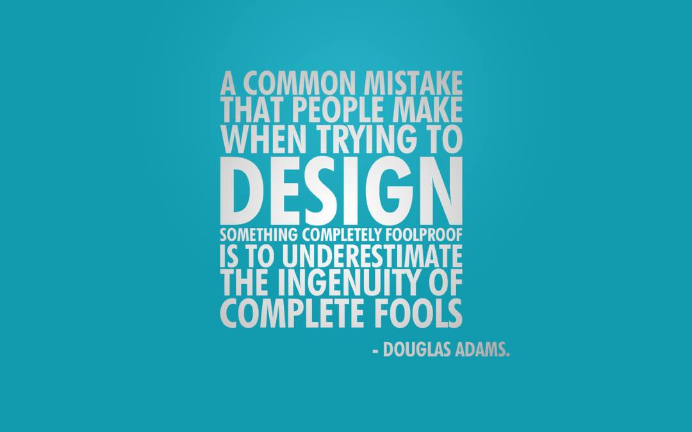


# A Blog about learning to code

> I think when you have a lot of jumbled up ideas they come together slowly over a period of several years - Tim Berners-Lee

## #100DaysofCode Journal - Restart - Round Five

**[@gipsitana on Twitter](https://twitter.com/gipsitana)** 

## HTML/CSS/JavaScript

Frontend Web Development


> "There is no problem so bad that you can't make it worse." [Chris Hadfield](https://www.youtube.com/watch?v=GplXBlTNO4A)

### Link of the month [A super quick way to try out CSS Grid](http://jensimmons.com/post/aug-15-2017/heres-super-quick-way-try-out-css-grid)

### Currently working on [Mermay Gallery](https://gipsi.github.io/mermay2018/responsivegrid.html)

### Improving designs with [tactics](https://medium.com/refactoring-ui/7-practical-tips-for-cheating-at-design-40c736799886)

### R5D35 1st June 2018
#### digitalart
The end of the Mermay challenge 2018. I practiced digital image manipulation by making a digital image of a mermaid and posting it on Instagram every day.  I was a couple of days behind at the start so caught up today and made four images.  Three for 29/30/31st of May and one for the first day of the Junicorn challenge.

Tidying and finishing up the Mermay CSS Grid gallery and making making a new one for Junicorn.

Put all the folders and images accumulated on the virtual desktop into a May folder and made a new one for June.


### R5D34 31st May 2018
#### simplicity over complexity

> "CSS Grid is here; it’s logical and fairly easy to learn. You can use it to accomplish all kinds of layouts that used to require JavaScript and frameworks, plus new kinds of layout nobody’s even tried yet." [The Cult of the Complex](https://alistapart.com/article/cult-of-the-complex)

And here's the really good list apart of CSS Grid links: 

    - [Getting Started with CSS Layout—Rachel Andrew, Smashing Magazine](https://www.smashingmagazine.com/2018/05/guide-css-layout/)
    - [Learn CSS Grid—Jen Simmons](http://jensimmons.com/post/feb-27-2017/learn-css-grid)
    - [CSS Grid Layout—MDN web docs](https://developer.mozilla.org/en-US/docs/Web/CSS/CSS_Grid_Layout)
    - [Grid by Example—Rachel Andrew](https://gridbyexample.com/examples/)
    - [A Complete Guide to Grid—Chris House, CSS-Tricks](https://css-tricks.com/snippets/css/complete-guide-grid/)
    - [Practical CSS Grid: Adding Grid to an Existing Design—Eric Meyer, A List Apart](https://alistapart.com/article/practical-grid)
    - [Jen Simmons Labs](http://labs.jensimmons.com/)
    - [Layout Land—YouTube](https://www.youtube.com/layoutland)
    - [A Book Apart: The New CSS Layout, by Rachel Andrew](https://alistapart.com/article/the-story-of-css-grid-from-its-creators)
    - [The Story of CSS Grid, from its Creators—Aaron Gustafson, A List Apart](https://alistapart.com/article/the-story-of-css-grid-from-its-creators)
    - [Transcript: Intrinsic Web Design with Jen Simmons (The Big Web Show)](http://www.zeldman.com/2018/05/02/transcript-intrinsic-web-design-with-jen-simmons-the-big-web-show/)


### R5D33 30th May 2018
#### Zoom, hover, onclick and opacity.

I watched some [Layout land](https://www.youtube.com/channel/UC7TizprGknbDalbHplROtag) videos on youtube then had some fun with CSS gid on the beach style image gallery page.  

https://gipsi.github.io/mermay2018/

### R5D32 29th May 2018
#### Updating stylesheets and media content
"That everyone has downloaded the same fundamental knowledge on any topic is becoming less and less probable."

"The beauty of hypertext is that we’re able to quickly add much-needed context helpful for n00bs but easy enough for those already in-the-know to scan over. And making documentation more human-readable benefits everyone." - [Brad Frost](http://bradfrost.com/blog/post/just/)

### R5D31 28th May 2018
#### Accessible?
Helping access websites on an iPad - frustrating.  A lot of waiting staring at a blank white screen.

### R5D30 27th May 2018
#### Validators and checkers
EdX CSS course Friday May 25th 2018

##### Some notes

Generally, it is a good idea to put a comment at the top of each CSS 

rule, or at the very least at the top of sets of rules that apply to a 

single category or section of your Web page. 


dark cyan  #008B8B  0, 139, 139

Results of Nu html checker on https://gipsi.github.io

1. Warning: Consider avoiding viewport values that prevent users from resizing documents.
   From line 23, column 5; to line 23, column 90
   ript>↩    **<meta name="viewport" content="width=device-width, initial-scale=1, user-scalable=no">**↩    <
2. Warning: Consider using the h1 element as a top-level heading only (all h1 elements are treated as top-level headings by many screen readers and other tools).
   From line 51, column 3; to line 51, column 41
   /></p>↩  **<h1 id="a-blog-about-learning-to-code">**A Blog


### R5D29 26th May 2018
#### CSS Zen garden and quiz
Finished Module 1, started module 2, W3C EdX CSS course - happy I got all the questions in the quiz right.

### R5D28 25th May 2018
#### Advanced HTML5 course on EdX
Skimmed through all six weeks of the course in a couple of hours so hopefully will have access to it once archived on May 31st

### R5D27 24th May 2018
#### CSS course on EdX
Started W3c CSS course on EdX Some history looking at websites on Wayback machine from 1996, useful validator and checker links, different styles for the same markup on Zen Garden site.

### R5D26 23rd May 2018
#### Grid containers and images
[Repurposing of content](https://www.w3.org/People/Bos/DesignGuide/repurposing)

### R5D25 22nd May 2018
#### Grid containers and images

### R5D24  21st May 2018
#### Grid containers and images

### R5D23  20th May 2018
#### Grid containers and images

### R5D22  19th May 2018
#### Grid containers and images

Working on my Mermay gallery to fit images into  CSS grid containers.

### R5D21  18th May 2018
#### Firefox developer tools

Getting to know Firefox developer tools better for layouts with [Dev tools and CSS Grid](https://www.mozilla.org/en-GB/firefox/61.0a2/whatsnew/#devtools)

### R5D20  17th May 2018
#### CSS Grid - Resizing and opacity

Resizing and overlapping images with fractional units and opacity for interesting layouts.
Jen Simmons CSS Grid [exercise 8](https://codepen.io/jensimmons/pen/xqJKdK)

### R5D19  16th May 2018
#### CSS Grid - One element

> Let go of idea that your grid framework effects every part of the page. A CSS Grid only effects one element + children. Jen Simmons, 16th May on Twitter

Learning [CSS Grid](http://jensimmons.com/post/feb-27-2017/learn-css-grid)

### R5D18  15th May 2018
#### CSS Grid children

Placing list children with grid-row and grid-column then resizing the browser is mesmerising.

```
<!doctype html>
<html>
<head>
    <meta charset="utf-8">
    <meta http-equiv="x-ua-compatible" content="ie=edge">
    <meta name="viewport" content="width=device-width, initial-scale=1">
<title>grid</title>
<link href="https://fonts.googleapis.com/css?family=Gruppo" rel="stylesheet">

<style>
html {
  font-family: 'Gruppo', cursive, lato, sans-serif;
  font-size: 12px;
  background: #6699cc;
  background: linear-gradient(to bottom, #f6e6b4 0%,#ed9017 100%);  }

ul {
  font-family: 'Gruppo', cursive, lato, sans-serif;
  font-size: 2rem;
  font-weight: bold;
  color: #fff;
  margin: 0;
  padding: 10px;
  background: #26558b;
  list-style-type: none;
  background: linear-gradient(to bottom, #cedbe9 0%,#aac5de 17%,#6199c7 50%,#3a84c3 51%,#419ad6 59%,#4bb8f0 71%,#3a8bc2 84%,#26558b 100%); 
  }
  
  li {
  padding: 1em;
  background: #F9423A;
}
  li:nth-child(3),
  li:nth-child(4),
  li:nth-child(7), 
  li:nth-child(10),
  li:nth-child(14),
  li:nth-child(16),
  li:nth-child(32){
  background: #FF9124;
}
  li:nth-child(3) {
	grid-column: span 2;  
}
  li:nth-child(4) {
	grid-row: span 2;  
  }	
  li:nth-child(7) {
	grid-column: span 2;
    grid-row: span 2;	
  }
    li:nth-child(10) {
	grid-column: span 2;  
}
  li:nth-child(14) {
    grid-row: span 2;	
  }
    li:nth-child(16) {
	grid-column: span 2;	
    grid-row: span 2;	
  }
      li:nth-child(32) {
	grid-column: span 3;  
}
  
  .grid-container {
 
  display: grid;
  grid-template-columns: repeat(auto-fill, minmax(150px,2fr));
  grid-gap: 2rem;
}
</style>
 	
</head>

<body>
<ul class="grid-container">

  <li>One </li> 
  <li>Two </li>
  <li>Three</li> 
  <li>Four </li>
  <li>Five </li> 
  <li>Six </li>
  <li>Seven </li> 
  <li>Eight </li>
  <li>Nine</li> 
  <li>Ten </li>
  <li>Eleven </li> 
  <li>Twelve </li>
  <li>Thirteen </li>
</ul>
<footer>  
</footer>
</body>
</html>
```

### R5D17 14th May 2018 
#### CSS Grid exercises

This awesome set of exercises [Here's a Super Quick Way to Try out CSS Grid by Jen Simmons](http://jensimmons.com/post/aug-15-2017/heres-super-quick-way-try-out-css-grid)


### R5D16 13th May 2018
#### Zoom on hover with CSS

Research ... [a pure css popup without JavaScript](http://www.sevensignature.com/blog/code/pure-css-popup-without-javascript/)

Interesting ... [comlex spiral](https://meyerweb.com/eric/css/edge/complexspiral/demo.html)

Try things.

This works, sort of - but I want the image itself bigger ... [zoom hover](https://www.w3schools.com/howto/howto_css_zoom_hover.asp)


Firefox asked if I wanted to stop this site ... [zoom imagesinside the container using mouse over](https://cssreset.com/zoom-images-inside-the-container-on-mouse-over-using-css/)


### R5D15 12th May 2018
#### Alternative styles

Image gallery. Each different skin has a separate HTML page for the moment.

### R5D14 11th May 2018
#### CSS Grid

### R5D13 10th May 2018
#### Styling buttons

### R5D12 9th May 2018
#### Styling buttons

Found a neat pack of css buttons to play with at [Codrops](https://tympanus.net/codrops/2009/09/02/20-fresh-and-colorful-css3-buttons/) 

Learning more about HTML `<form>, <span>, <option> and <select>` tags.  Trying out dropdown menu's and buttons for switching stylesheets and some Flexbox and Grid. [MDN Forms](https://developer.mozilla.org/en-US/docs/Learn/HTML/Forms)

Playing with [Grid boxes from Codrops reference section](https://tympanus.net/codrops/css_reference/grid/)

And reading Shaye Howe on [Semantics and accessability in HTML](https://tympanus.net/codrops/css_reference/grid/) 

### R5D11 8th May 2018
#### Styleswitching buttons

Making buttons as an styleswitcher seems a good plan to offer the viewer a choice of background styles when visiting a website.
[Alternative Style: Working With Alternate Style Sheets](https://alistapart.com/article/alternate#) Gave me a deeper understanding of 
The three different relationships external style sheets can have with the document: persistent, preferred, and alternate. I tpent a while thinking about using JavaScript for dynamic style switching and followed along with this article but got stuck on how to get the button to make the function work.

Eventually I made some HTML button links with `onclick` and `href` using the `<form>` tag as suggested by [Hyperlink Code](http://www.hyperlinkcode.com/button-links.php) 

First version:
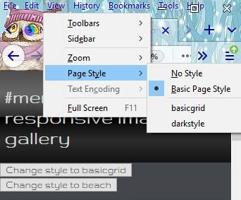


### R5D10 7th May 2018
#### Darkstyle for the responsive grid gallery

Made an alternative stylesheet darkstyle.  Investigating how this can be accessed on different devices and through various browsers showed that not many seem to support this option.  

I didn't manage to access any of the options on an Android device and Chrome browser required an extension which I couldnt get to work.

### R5D9 6th May 2018
#### How to be a digital nomad and 12 things to consider before setting off.

>"Technology isn’t an industry, it’s a method of transforming the culture and economics of existing systems and institutions ~ Anil Dash" 

[12 Things Everyone Should Understand About Tech](https://anildash.com/2018/04/07/12-things-everyone-should-understand-about-tech/)

Some tips from the BBC on [How to be a digital nomad](http://www.bbc.co.uk/programmes/articles/LYKjnLMVJ557Xq21pPY1z7/how-to-be-a-digital-nomad)

### R5D8 5th May 2018
#### Skins, themes and view>page style

Having created a new colour scheme for the photo gallery page it occurred to me that it would be nice to offer the viewer the option of changing the theme.  I remembered Jeremy Keith's [adactio](https://adactio.com/about/site/?skin=seaside) site has a theme chooser so went to have a rummage around his source code for some clues.  There's a theme chooser form on the site which is just the kind of thing I'd like to be able to do.

 ####  Alternative stylesheets

[*Web Style Sheets* CSS tips & tricks](https://www.w3.org/Style/Examples/007/alternatives.en.html) was the next stop and explained succinctly how to offer alternative style sheets.

The gist of it is to add alternate stylesheets. `<link rel="alternate stylesheet" title="16 line css grid" href="css/style.css">` which show up in the view menu on the top toolbar.  I added the 16 line css stylesheet with the link in the head and it worked! There are now three themes to choose from .

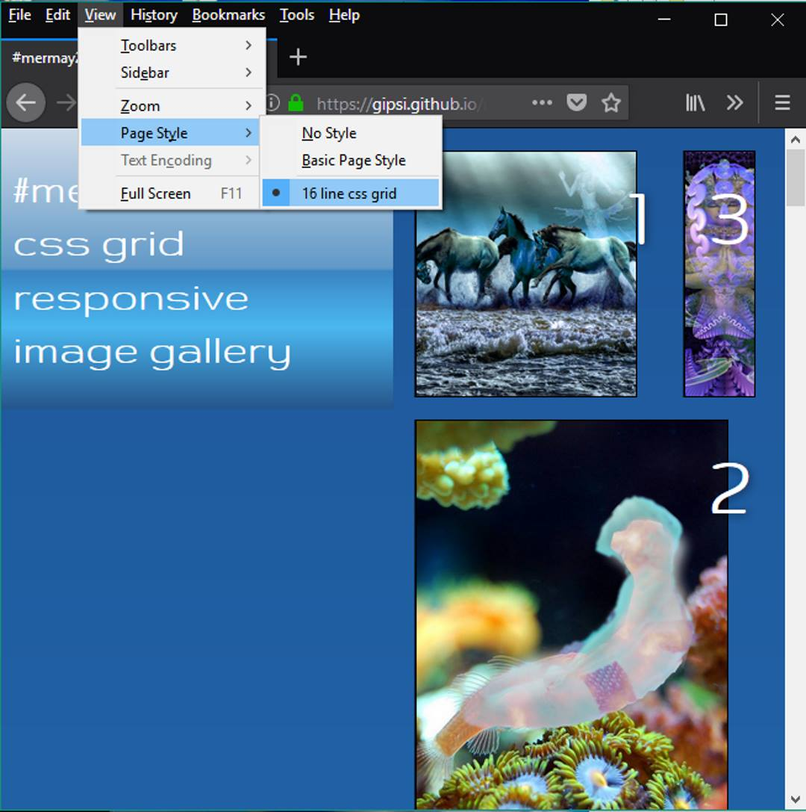

Am now going to try it out on different browsers and devices.  Not sure how many people know you can do this.  I only just found out so I'll be checking to see if sites have **alternative stylesheets** in future.


### R5D7 4th May 2018
#### May the 4th be with you!
Mermaid dreaming the Eagle Nebula


#### Rewind, undo and version control

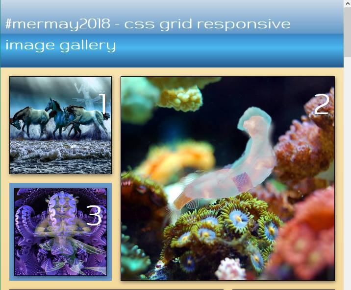

Some attention to fonts.  I was wondering why it wasn't changing to the one I wanted then realised I'd forgotten the link in the header to Google fonts for the one I was attempting to use.

`<link href="https://fonts.googleapis.com/css?family=Gruppo" rel="stylesheet">`

There's a lot to know about fonts and [typography](https://en.wikipedia.org/wiki/Typography) and I've spent quite some time reading about it.

>_'...at a time when scientific techniques can support the proven traditions (e.g., greater legibility with the use of serifs, upper and lower case, contrast, etc.) through understanding the limitations of human vision, typography as often encountered may fail to achieve its principal objective: effective communication. Wikipedia'_

Do serifs make text more readable?  I find sans-serif less cluttered.

I enjoy the back stories about font creation which is the main reason I use Lato and Gruppo until I know more.

I was tinkering about on Glitch with the font links and copy /pasted a great block of the wrong code.  Thank goodness for the rewind function in the log section.

Colour gradient backgound and title bar [colorzilla](http://www.colorzilla.com/gradient-editor/) seems to be a useful tool for the css codes.

Bit of a moment when the link I put on twitter didn't display correctly from the code I'd put on GitHub.  Relieved to find it worked on my desktop files. Very difficult to find where the problem was, tried isolating different files and bits of code with no joy. So in the end I deleted the GitHub files and replaced with the ones that work on my machine.

I get the need for version control.  And folder trees with sensible file names.


### R5D6 3rd May 2018
#### GitHub and paint.net

Rather minimal coding as I got involved in learning to use layers with [paint.net](https://www.getpaint.net/index.html) for the mermay challenge but I am updating the image gallery and using dev tools and GitHub so practicing with html and markdown for this log.

### R5D5 2nd May 2018
#### Chrome dev tools

Today posting to Instagram with Firefoxdev tools didn't work. It's bit of a workaround but easier than using phone so I persisted and it did work with Chrome.

### R5D4 1st May 2018
#### #mermay2018 - Css grid responsive image gallery

Various size numbered boxes with drop shadows for the #mermay challenge where for the month of may I make a piece of digital art every day with the theme of mermaids.  

I am working through [Layout Lab of Jen Simmons](http://labs.jensimmons.com/), inspired after watching [Layout Land videos](https://www.youtube.com/playlist?list=PLbSquHt1VCf18lllS0C5quAaOcsuMAC70) and have borrowed code from there to adapt and play around with for [#mermay2018 project](https://gipsi.github.io/mermay2018/). 

**Tip:** You can post to Instagram on desktop with Firefox DevTools responsive mode.

Version 1

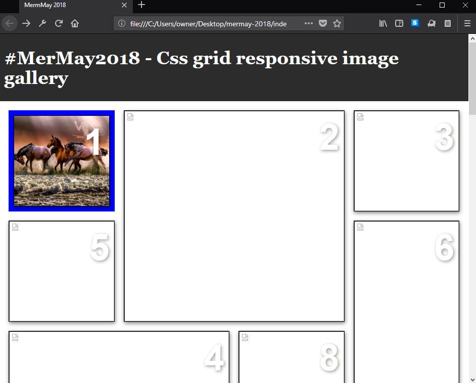


### R5D3 30th April 2018
#### CSS simplified with Grid

Just sixteen lines of CSS for a [responsive page of photos](https://inquisitive-hose.glitch.me/).

```
* {
  box-sizing: border-box;
}
body {
  background: linear-gradient(to bottom, #1e5799 0%,#2989d8 50%,#207cca 51%,#7db9e8 100%);
  margin: 0;
}
main {
  display: grid;
  grid-template-columns: repeat(auto-fit, minmax(200px, 1fr));
}
img {
  display: grid;
  box-shadow: -1px 0px 0px rgba(0,0,0,0.6);
  width: 90%
} 
```
Two Layout Land videos today:
  - [Basics of CSS Grid: The Big Picture](https://www.youtube.com/watch?v=FEnRpy9Xfes&list=PLbSquHt1VCf18lllS0C5quAaOcsuMAC70)
  - [Incredibly Easy Layouts with CSS Grid ](https://www.youtube.com/watch?v=tFKrK4eAiUQ&list=PLbSquHt1VCf18lllS0C5quAaOcsuMAC70&index=2)

Notes:
  - _explicit v implicit_ you define the explicit, the browser defines the implicit
  - _autoplacement algorithm_
  
Here's the **HTML** the _essence of the content_ with white space, photo links and alt texts removed from the Glitch version.

```
<!doctype html>
<html lang="en">
<head>
  <meta charset="utf-8">
  <meta http-equiv="x-ua-compatible" content="ie=edge">
  <meta name="viewport" content="width=device-width, initial-scale=1">
  <title></title>
  <link rel="stylesheet" href="style.css">
</head>
<body>
<main role="main">  
  
  
  
  
  
  
  
  
</main>  
</body>
</html>
```

### R5D2 29th April 2018

Went for some adventures in [Layout Land](https://www.youtube.com/channel/UC7TizprGknbDalbHplROtag) the seven part YouTube series on Resilient CSS by Jen Simmons.  I have a much clearer picture of how CSS works or not in different browsers and devices and whether it matters.  

The most significant thing for me is understanding that the resilience and robustness of HTML and CSS is because they are declarative languages so mistakes are generally skipped over and ignored by browsers.  This is different to imperative programming languages which may fail if there is an error in syntax and such.  There's a concise explanation of the difference in Jeremy Keith's book [Resilient Web Design](https://resilientwebdesign.com/chapter4/#Robustness%20Principle%2C%20also%20known%20as%20Postel%E2%80%99s%20Law%3A%0D%0A%0D%0A%20%20%20%20Be%20conservative%20in%20what%20you%20send%3B%20be%20liberal%20in%20what%20you%20accept.) 

Robustness Principle, also known as Postel’s Law:

> "Be conservative in what you send; be liberal in what you accept."

The seven Layout Land videos are about 10-15 minutes each.  This list is from the notes I took whilst watching them:

  - Web-no-matter-what, original concept and progressive enhancement.
  - Superpowers, statuses, statistics and analytics.
  - Ignoring weird, robust and resilient. 
  - Overrides, tweaks, details and craftsmanship. 
  - Featurequeries-1, media query type conditional wrap `@supports (foo: value) {// some code here}`.
  - Featurequeries-2, to not or not to not and why flexbox doesnt need them anyway.
  - Featurefail, ask how well does this feature fail.
  
Very much enjoyed this excursion and have come away with some better ideas on how to consider the variety of formats that the content can be transformed into.

> 

###  R5D1 28th April 2018

A restart after falling behind last week.  Learning some CSS grid then tried out the css writing mode after reading this [Jen Simmons](https://24ways.org/2016/css-writing-modes/) post. 

Progressive enhancement practice website [complete-baker](https://complete-baker.glitch.me/) on Glitch.

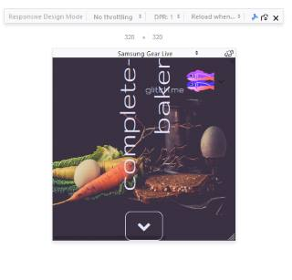

---

### Days 33 - 39 April 9th to 16th
#### UX, baking, grid and nets

- Udacity Android UX
- Making a baking website on Glitch - [complete-baker](https://complete-baker.glitch.me/)
- CSS grid practice with Wes Bos '#Griddyup'.  He covers a lot quite quickly for me but without timed limits to viewing the course I can pause and repeat things for practice.
- Deep learning - neural nets and algorithms the basics.  

### Day 32 April 8th
#### CSS Grid, Flexbox and transform.
- Grid and flexbox Variable widths and responsiveness with Wes Bos. 
- Skewing box shapes with transform.
- Some experimental css styling, colour themes and background images.

- Logical and critical thinking with Futurelearn. Arguments and statements. 
> - P1 Premise 1
> - P2 Premise 2
> - P3 And so on for as many premises as there are in the argument.
> Therefore.
> - C conclusion
> I included this here because I think it helps with the way I think about coding.

I also did some of a mindfulness course which is good for clarity, awareness and focus. 


### Day 31 April 7th
#### The intersection of code and design.
##### User testing, the difference between UX and UI, low-fidelity-resolution wireframing-prototyping,  


Today I was looking into user testing and watched some videos by Steve Krug and explored his website [Advanced Common Sense](http://sensible.com/dmmt.html)


I am interested in the intersection of coding (for web development) and design and did some tutorials with Udacity's 
[UX Design for Mobile Developers](https://eu.udacity.com/course/ux-design-for-mobile-developers--ud849)

It involved some reading:

-  [The Skeptic’s Guide To Low-Fidelity Prototyping](https://www.smashingmagazine.com/2014/10/the-skeptics-guide-to-low-fidelity-prototyping/)
-  [A walk through the wireframing process](https://medium.com/@kelliblum/a-walk-through-the-wireframing-process-25ea85c399c6)
- [How to design a low-fi wireframe](https://www.creativebloq.com/wireframes/how-design-low-fi-wireframe-91516934)


and some new tools:

- [Prezi](https://prezi.com/) for presentation (*of low resolution wireframe flow.*)
[colorful nature my first presentation template](https://prezi.com/view/djGBBv9hXQeSZLNH7Bdm/)

- [Infogram](https://infogram.com/) for a quick infographic.
- 
- [Notion](https://www.notion.so/) All-in-one workspace (to try). *May cause lag.*

Next ...

 

My answer in the quiz about the sign in form was to enlarge the entry boxes.  This was not looking at the bigger picture. The advisory for this was: *"It's easy to forget the big picture. Especially if detailed thinking is something you really love (which is the case with many developers).*

*It takes some discipline to keep your thoughts at a high-level when that's what's best for your product and users, but by the end of this course, you'll have plenty of techniques to help you do just that!"*

 

- Google checkout or PayPal checkout for payments.

 

- Don't use a sign in form use a button to sign in with Google or Facebook.

 

- The difference between UX and UI is that UX involves the backend code that you can't see as well as the frontend code, while UI  is just the frontend code.

 

*"The question with technology is no longer how, but why? In a world of endless connectivity and limitless computing, we need to ask why we are doing whatever it is we are doing, before it is too late."*

*"Thus, we should focus on the skills that are inherently human – critical thinking, creativity, emotional intelligence and cognitive flexibility. Non-routine, cognitive work is the future."*

 - [Technology vs. Humanity](https://tomorrowaugmented.com/insights/technology-vs-humanity/)

 

 - [4 Myths About Apple Design, From An Ex-Apple Designer](https://www.fastcodesign.com/3030923/4-myths-about-apple-design-from-an-ex-apple-designer)

- [Design-minded development](https://classroom.udacity.com/courses/ud849/lessons/1613818915/concepts/16394390140923)

 

 - [Rocket Surgery Made Easy by Steve Krug: Usability Demo](https://www.youtube.com/watch?v=QckIzHC99Xc)

 

- [DIY user](https://www.youtube.com/watch?v=VTW1yYUqBm8)

 

21.30 - Developers like complicated stuff (releases endorphins).

23.30 - It's very hard for us to remember that they don't know what we know.

- [Fat finger syndrome and the "lose-lose-win design".](https://marketoonist.com/2016/05/fatfinger.html)


### Day 30 April 6th
#### Yak shaving and  some html in the shell

Hello Firefox Notes! I'm pleased to meet you.


I just spent half an hour trying to work out how to write a note. 


And then ... some ...

- [Yak Shaving](https://projects.csail.mit.edu/gsb/old-archive/gsb-archive/gsb2000-02-11.html)


My searching led to this Moz://a HACKS post (love the falling K in HaCKS title when it's moused over) by Lin Clark:

- [Inside-a-super-fast-css-engine](https://hacks.mozilla.org/2017/08/inside-a-super-fast-css-engine-quantum-css-aka-stylo/)

and ...

A new word! 
- [Deleuzional](https://www.steveklabnik.com/deleuzional.html) about the philosoper

- [Gilles Deleuze](https://plato.stanford.edu/entries/deleuze/)

- [JavaScript to Rust and Back Again: A wasm-bindgen Tale By Alex Crichton](https://hacks.mozilla.org/2018/04/javascript-to-rust-and-back-again-a-wasm-bindgen-tale/)

- [emojidex/emojidex-web-samplepage](https://github.com/emojidex/emojidex-web-samplepage/blob/master/index.html)

- [Writing an x86 “Hello world” boot loader with assembly Martin Splitt](https://medium.com/@g33konaut/writing-an-x86-hello-world-boot-loader-with-assembly-3e4c5bdd96cf)

- [Latency Numbers Every Programmer Should Know](https://people.eecs.berkeley.edu/~rcs/research/interactive_latency.html)

- [nchain](https://nchain.com/en/)

- [The Rust Programming Language](https://doc.rust-lang.org/book/)

- [What's the best book for learning to program?](https://www.quora.com/Whats-the-best-book-for-learning-to-program)

- [Nodeschool](https://nodeschool.io/)

had a go with

"Try any Node.js package right in your browser".

- [Runkit+npm stream-adventure](https://npm.runkit.com/stream-adventure)

using Powershell

Got stuck on making a js file with a console. log in it.

So read this:

- [powertip-use-powershell-to-create-new-file](https://blogs.technet.microsoft.com/heyscriptingguy/2015/06/07/powertip-use-powershell-to-create-new-file/)

- [Build simple HTML with PowerShell](https://blogs.technet.microsoft.com/heyscriptingguy/2018/03/15/powertip-build-simple-html-with-powershell/)

Some Code!  Html in PowerShell.

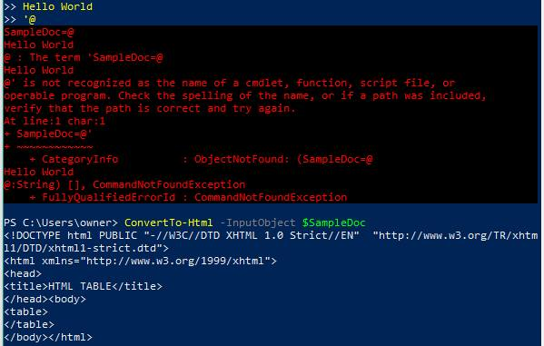


...and a bit about
- [npm naming rules](http://blog.npmjs.org/post/168978377570/new-package-moniker-rules)


So there we have it.  Yes, I like the notes in Firefox.

P.S. Just had to click return to start taking notes.


### Day 29 April 5th

#### Dev tools and Grid

Today I did some more of the Wes Bos CSS Grid course.  

I went over the setup and the basics again.  

Lots of  tips and  as well as Grid tutorials.  

He walks through how to use the tools swiftly, concisely and thoroughly, and so far I haven't got stuck. 

 - VS Code with Emmet 

 - Command line terminal (I used Powershell)

 - Node.js and npm

 - Firefox developer tools for Grid

 - Browserify updates straight into the browser from VS code, especially helpful for front end dev.

   I made a copy of the code folders and spent some time with the regular stylesheet, changing the colours and image and explored how to adjust the opacity of the

   - image 


   - items

   - fonts

     over the two colour gradient background. 

     #### CSS Grid the starter code: 
   ```
       <div class="container">
        <div class="item">1</div>
        <div class="item">2</div>
        <div class="item">3</div>
        <div class="item">4</div>
        <div class="item">5</div>
        <div class="item">6</div>
        <div class="item">7</div>
        <div class="item">8</div>
        <div class="item">9</div>
        <div class="item">10</div> 
       </div>
      
   
       .container {
           display: grid;
           grid-template-columns: 200px 500px;
           grid-template-rows: 200px 100px 400px;
           grid-gap: 20px;
         }      
   ```

### Day 28 April 4th
Code session today began with putting the directional chevrons back on my current live web page project, they had gone missing!  Not sure why but they were still all fine in my offline version so I updated with that.  That led on to making another image link, sorting out files and other routes for linking. Then I started another page on the [Glitch Bio](https://noisy-month.glitch.me/) site 
So some buttons and links and badges in html.  Connecting things.
Understanding the [z-index](https://developer.mozilla.org/en-US/docs/Web/CSS/z-index) CSS with MDN.
Looking at different ways to resize and make images responsive. 
And I found this useful tool that quickly generates a website style guide with colours, fonts, sizing and spacing [Stylify Me](http://stylifyme.com/?stylify=gipsi.itbit.me)


### Day 27 April 3rd

A new landing page for my website! 

What is this!?! 👇
```
gipsi.itbit.me/#bornwildgipsi.itbit.me/#bornwild</a>

      
```  

This is where I'm trying to make a clickable image link to my new web page in markdown (when falling asleep).
I was very determined and didn't want to give up.  It seemed like such a simple task.  I kept phasing in and out of conciousness as I persisted.  Stack Exchange had most suggestions and using markup seemed the only solution, even getting this to work proved completely beyond me.  In the end I did give up and went to sleep feeling dismayed and frustrated.

After a sleep and some food I came back to the problem.  Much more alert and awake.

First I wrote this regular link.
``` [gipsi.itbit.me/#bornwild](http://gipsi.itbit.me/#born-wild) ```

[gipsi.itbit.me/#bornwild](http://gipsi.itbit.me/#born-wild)

Then I wrote it like this with the image I want to use in an html `````` tag as the link wrapped in an ```<a>``` tag.

```
<a href="http://gipsi.itbit.me/#born-wild" target="_blank">
  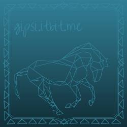	
</a>
```

<a href="http://gipsi.itbit.me/#born-wild" target="_blank">
  	
</a>

Better. but going to the wrong part of the page.  And it does work here, but not on the GitHub Pages Jekyll version. This is always a problem I eventually come up against with templates, if something doesn't work it's another opaque layer to peel away and try to understand and fix.

[gipsi.itbit.me](http://gipsi.itbit.me/)


<a href="http://gipsi.itbit.me/" target="_blank">
  	
</a>

The images are experiments with logo design that I made on the [Canva](https://www.canva.com/design/DACz5SjGNq8/Upc5kqrUYvTiUkqMGA1p7Q/edit) website. These are made before I spotted the tutorials.  I'll do the tutorials and see if they improves my technique and aesthetic sensibilities.

After reading about [writing style guidelines](https://developer.mozilla.org/en-US/docs/MDN/Contribute/Guidelines/Writing_style_guide) on the MDN wiki I've been pondering style and layout and the itersection between coding and design so I was interested to read this blog post about the [SEEK styleguide](https://medium.com/seek-blog/sketching-in-the-browser-33a7b7aa0526)

Next I had a go with [figma](https://www.figma.com/) an in browser design tool with a styleguide API. I watched some YouTube channels to learn how to use it.

Also looked at [Surge.sh](surge.sh)where you can build and host apps from the command line.

I just figured out how to do the image that links in markdown. 🎆 That exclamation mark at the after the first angle bracket is the code to display the image, I knew there was a way.

``` [.jpg)](http://gipsi.itbit.me/) ```

[.jpg)](http://gipsi.itbit.me/)

And now it works in the Jekyll too - phew! For all the frustrations it's a great feeling when stuff does work.


### Day 26 April 2nd

Making an html/css web page - a new homepage for my projects site.

### Day 25 April 1st
I'm starting to view and read the source code of websites more often  and today I noticed  a back button at the bottom of a page I was viewing.

               ```
               <a href="#" class="btn-to-top" title="Back to top">
			<i class="fa fa-lg fa-chevron-up"></i>
			<span>Back to top</span>
		</a>
		```

I read a bit about the Font Awesome icons and put one on a page I'm making that I'd made a mental note of needing one.

I read a few things on MDN that I wanted to be clearer about.  Increasingly I find it the best place to go for reference and learning and such a pleasant experience to use that I plan make a habit of visiting more frequently.  One thing I looked up was the [Line Break element](https://developer.mozilla.org/en-US/docs/Web/HTML/Element/br).  I didn't know why it is often written  ```<br />``` rather than ```<br>``` and MDN had the answer:

>  In XHTML documents, write this element as ```<br />```

I investigated [HTML5 Boilerplate](http://h5bp.net/) and became a member of [The Internet Defence League](https://www.internetdefenseleague.org/) and displayed some badges,


### Day 24 March 31st
More time (many hours) learning about APIs in general, the [Met Office datapoint](https://www.metoffice.gov.uk/datapoint) in particular.  Very frustrated by this.  I got to the 'make a weather app' stage of FreeCodeCamp last year and hit a wall.  So much I don't know.  

Following MDN basic tutorials they're thorough which is good I'm picking up little things which I've missed like in file naming using a dash instead of an underscore.

#####  A historical artefact that needs to be included for everything to work right.

>`<!DOCTYPE html>` — the doctype. In the mists of time, when HTML was young (about 1991/2), doctypes were meant to act as links to a set of rules that the HTML page had to follow to be considered good HTML, which could mean automatic error checking and other useful things. However, these days no one really cares about them, and they are really just a historical artefact that needs to be included for everything to work right.  [So whay is html really? MDN](https://developer.mozilla.org/en-US/docs/Learn/Getting_started_with_the_web/HTML_basics) 

Writing in Markdown is gently reminding me of the importance of practice in learning to be any good at things.

### Day 23  March 30th

A very long time figuring how to use [Met Office datapoint](https://www.metoffice.gov.uk/datapoint) with a view to making a weather app.  Presently unfathomable.

Today was my 99th day of [#100DaysofX](http://www.100daysofx.com/) which I started on the winter solstice, 21st December '17, as a personal challenge so I began putting together some files for a web document as a record.

### Day 22 March 29th

Remixed and played with a basic website starter kit on [glitch.com](https://glitch.com).  Really enjoyed the setup and speed it renders great fun. [noisy-month](https://noisy-month.glitch.me/) 

### Day 21 March 28th

I watched the introduction and the first four videos on this Eduonix site. [Become a certified Web Developer](https://www.eduonix.com/freebies) 

 
### Day 20 March 27th

More than an hour fixing the volume button on the taskbar of Windows 10.  The button was there but doing nothing.  Quite a few suggestions I visited started with right click on the button but this didn't work either.

Eventually this [Windows 10 skills](https://windows10skill.com/windows-10-volume-control-is-not-working/) site had the solution:  Change Audio Services, which was basically switch the audio manager off then on again and reboot.


So I was wondering if I could add a YouTube video to this page.  No, but I can link to one with an image like this:

```
<a href="http://www.youtube.com/watch?feature=player_embedded&v=YOUTUBE_VIDEO_ID_HERE
" target="_blank"></a>
```


I watched this [DevTips video](https://www.youtube.com/watch?v=hExwnLlj2xk&index=44&list=PL940Wy-AWgfaSihpsvZ3rSkvS0Djs00FY&t=0s) about making a splash page yesterday and had planned to make one myself today.  Tried code from link on CodePen but it didn't work.  The syntax wasn't complete, I tried filling it in but gave up as IDK [SASS](http://sass-lang.com/) (or [LESS](http://lesscss.org/))! ... just yet.

Brad Traversy put the code for a [full screen landing page](https://codepen.io/bradtraversy/pen/XerXYV)  on CodePen so I used that instead.  

I also looked at his site to check out some video tutorials at        [ ](http://www.traversymedia.com/#page-top)

Linked to another site called [EduOnix](https://www.eduonix.com/) where I started a short video tutorial on making an[HTML5 distance meter](https://www.eduonix.com/courses/Web-Development/Learn-HTML5-Distance-Meter) I watched about a third then needed to switch to reading about [XAMMP](https://en.wikipedia.org/wiki/XAMPP) a [free and open source](https://en.wikipedia.org/wiki/Free_software) [cross-platform](https://en.wikipedia.org/wiki/Cross-platform) [web server](https://en.wikipedia.org/wiki/Web_server) [solution stack](https://en.wikipedia.org/wiki/Solution_stack) package developed by Apache Friends.


Back to the landing page.  I like to use [web safe colors](https://html-color-codes.info/web-safe-colors/) as often using color-picker chosen ones doesn't work.  The [HTML Color Names](https://html-color-codes.info/color-names/) has more choice though and I used the hex for lavender E6E6FA for the title.

[Bio splash landing](https://gipsi.github.io/bio/#)


### Day 19 March 26th

I set up  new blog on Blogger for creative writing and called it [Bio](https://gipsitana.blogspot.co.uk/2018/). 

Importing the writing I'd put a Google Docs template  into Blogger and editing the HTML there went OK. Although the copious amounts of code in a great block  in the head tag was a surprise (there are widows and orphans in there too 😮) . I did proceed and edit in HTML.  It took a bit of fiddling about to get the title photo in the right place.  The backgound photo of the blog looked alright to begin with on the laptop. only later on the phone I noticed the picture repeating, that wont do! 


Learnt some basic use of google analytics watching their tutorial videos then installed it by adding a script tag they gave me to paste in.  Now it's all about learning how to read and use the analytics software.

The code looks quite different.  Much easier to read in the browser with 'view source'.

 


### Day 18 March 25th

#### [The Absolute Minimum Every Software Developer Absolutely, Positively Must Know About Unicode and Character Sets (No Excuses!)](https://www.joelonsoftware.com/2003/10/08/the-absolute-minimum-every-software-developer-absolutely-positively-must-know-about-unicode-and-character-sets-no-excuses/)

Emoji homework! ... on unicode and character sets.


### Day 17 March 24th

Whilst exploring tumblr I found you can edit the html.

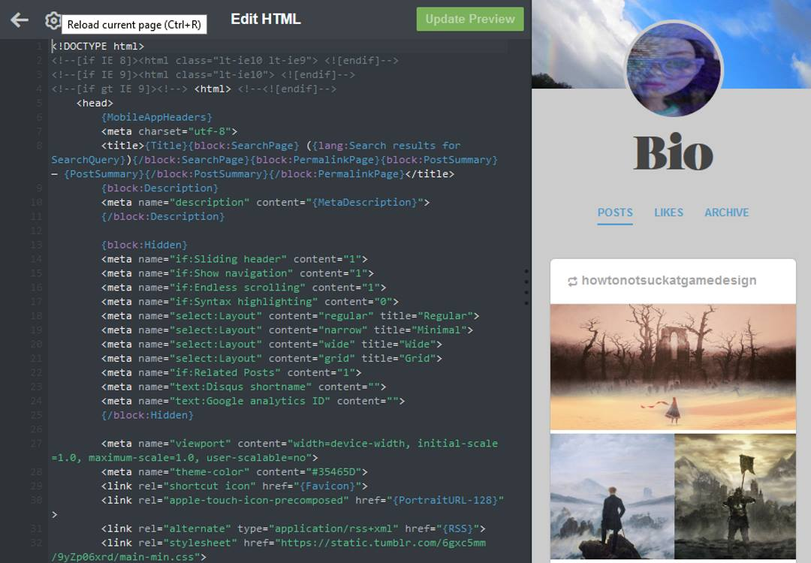


### Day 16 March 23rd

I made an [emojigrid](https://gipsi.github.io/emojigrid/) GitHub repo last night but fogot how to set the url for it.

Sorted that out: go to settings>scroll down to gh-pages section>publish default is **None**, change that to Master or gh-pages.

Filled in the most popular from a list on [emojipedia](https://emojipedia.org/). Then used the randomise button and picking ones I like.  

Found out you can change the skin colour of people emojis. 🧜🏿‍♂️ .  The code for that in HTML is 

```&#x1F9DC&#x1F3FF``` This is  the two code point numbers that represents the emoji plus a modifier in Unicode with  the prefix U+ changed to a character escape &#x.  Some more on [character escapes in css and markup](https://www.w3.org/International/questions/qa-escapes)

Emoji modifiers were added based on the [Fitzpatrick scale](https://en.wikipedia.org/wiki/Fitzpatrick_scale) of skin tones in 2015.

I made a CodePen pen too: [CSS Grid Playground - placing items        ](https://codepen.io/gipsi/pen/BrZGRP)


Using [Typora](https://typora.io/) for Markdown - Lovely to use now I'm getting the hang of it.


### Day 15 March 22nd

Practicing what I learnt yesterday by placing emoji items in CSS Grid boxes.
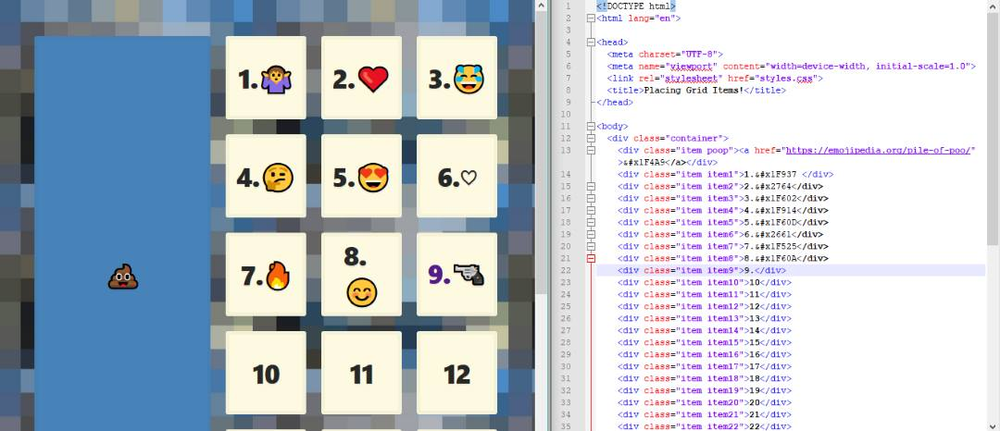


### Day 13/14 March 20th/21st

#### How I put a poop emoji in my  HTML

Here's a comprehensive [encyclopedia of emoji! 😀](https://emojipedia.org/)

Hello 💩 

Well that was easy!  No not really. This is Markdown and copy paste is working fine.  Not so in HTML Markup.

Do I want an [emoji domain name?](https://blog.farrant.me/getting-an-emoji-domain-in-2015/)

Actually no, that was interesting but a distraction.  I want to put emoji's in CSS Grid boxes in an HTML5 document.

Ah!  This looks helpful. [How to Insert Emojis in HTML](https://linuxwebdevelopment.com/how-to-insert-emojis-in-html/)

And another [emoji list ](https://unicode.org/emoji/charts/full-emoji-list.html)

I'll try  a [unicorn face](https://emojipedia.org/unicorn-face/) 

Get to the the [code point](https://codepoints.net/).

U+1F984

Change it to this.

&#1F984;

Nope that doesn't work.

[Handling character encodings in HTML and CSS (tutorial)](https://www.w3.org/International/tutorials/tutorial-char-enc/) 

 [In a nutshell](https://www.w3.org/International/tutorials/tutorial-char-enc/#quicksummary)

Save your pages as UTF-8.  Yep did that right from the start.

How about  W3School - try an [HTML5 entity](https://www.w3schools.com/charsets/ref_html_entities_u.asp).  

**uhblack - a black box** &uhblk; alt="waving black flag" 🏴

Yep that works with this code: ```&#9600;```, or this, ```&#x2580;```, or this, ```&uhblk;```.

But I don't really want an **entity** I want an **emoji**.😒 


Sooo, back to the [pile of poo.](https://emojipedia.org/pile-of-poo/)

OK some [history of the poop emoji](https://www.fastcompany.com/3037803/the-oral-history-of-the-poop-emoji-or-how-google-brought-poop-to-america) and stuff about [code points](https://codepoints.net/U+1F4A9.)

When I copy and paste the emoji code point code it just transfers a two question marks, like this:``` <div class="item item10">??</div>``` which then both appear in my CSS Grid box. No emoji.


But there is an [Embed this codepoint] button.  A pop up box appears.

> Embed this codepoint in your own website by simply copy-and-pasting the following HTML snippet:

```
<iframe src="https://codepoints.net/U+1F984?embed"
        style="width: 200px; height: 26px;
        border: 1px solid #444;">
</iframe>
```

> If you want, you can freely change width and height to meet your needs. The layout will adapt accordingly.


This is alright, I have got the unicorn face, but also the code point and the name of the emoji written beside it.  I'd really rather just have the emoji.

Looking at the iframe code and wondering how to ditch the surplus info went to the codepoints link in the code. [This unicorn page](https://codepoints.net/U+1F984?embed)  has at the bottom an [HTML-Escape code](https://www.w3.org/International/questions/qa-escapes ), same as the one I tried earlier but with an x ```&#x1F984;```  It works! 🦄


### Day 11/12 March 18th/19th - CSS Grid

#### Notes on: Naming Lines, Block Fitting and Centering 

For horizontal scrolling: grid-auto-flow: column;


#### Naming Lines

(Doesn't show up in dev tools yet)

The lines between the boxes can be named by putting the names inside square brackets in front of the value of the boxes, e.g.
```
.container {
  display: grid;
  grid-gap: 20px;
  grid-template-columns: [site-left] 1fr [content-start] 500 px [content-end] 1fr [site-right];
  /* Can be multiple names too: grid-template-columns: [sidebar-start site-left] 1fr [sidebar-end content-start] 500 px [content-end] 1fr [site-right]; */
  grid-template-rows; [content-top] repeat(10, auto) [content-bottom];

.item3 {
  background: slateblue;
  grid-column: content-start;
  grid-row: content-top / content-bottom;
```


#### Block fitting 

grid-auto-flow: dense;

An alternative for the grid-autoflow property. 

If the order of different size boxes is not too important this is useful for filling the page without leaving holes or gaps.
```
.container {
  display: grid;
  grid-gap: 20px;
  grid-template-columns: repeat(10, 1fr);
  grid-auto-flow: dense;
}

.item:nth-child(6n) {
  background: cornflowerblue;
  grid-column: span 6;
}

.item:nthchild(8n) {
  background: tomato;
  grid-column: span 2;
}

.item:nth-child(9n) {
  grid-row: span 2;
}

.item18 {
  background: greenyellow !important; /* Have to have the !important because nth-child is more specific than the item number. */
/* Then if you want to anchor this item at the end */
  grid-column-end: -1 !important;
```
For horizontal scrolling: grid-auto-flow: column;


#### Centering

6 items come with justify:

(justify = row axis
align = column axis)

justify-items:
align-items:

justify-content:
align-content:

align-self:
justify-self:

For reference see:
CSS-TRICKS [A Complete Guide to Grid](https://css-tricks.com/snippets/css/complete-guide-grid/)

### Day 9/10 March 16th/17th 2018 - CSS grid template area and Poop Emoji

Stuck on how to put emoji into html.

### Day 8 March 15th 2018 - CSS grid Responsive by default (no more media queries?) 

#### auto-fit, auto-fill and minmax().

```
 .container {
      display: grid;
      grid-gap: 20px;
      border: 10px solid var(--yellow);
      grid-template-columns: repeat(auto-fill, minmax(150px, 1fr));
```
- [Wes Bos ](http://wesbos.com/) [CSS GRID](https://cssgrid.io/)
- [Smashing Magazine Using Media Queries For Responsive Design In 2018](https://www.smashingmagazine.com/2018/02/media-queries-responsive-design-2018/)
- [Smashing Magazine Understanding CSS Layout And The Block Formatting Context](https://www.smashingmagazine.com/2017/12/understanding-css-layout-block-formatting-context/)


### Day 7 March 14th 2018 - CSS grid workout

#### Sizing tracks, repeat function, sizing and placing items

``` 
    .container {
      display: grid;
      grid-gap: 20px;
      /* Make the grid 10 columns wide, every other taking up twice the free space */
      grid-template-columns: repeat(5, 1fr 2fr);
      /* Make the grid have 10 explicit rows, 50px high each */
      grid-template-rows: repeat(10, 50);
    }

    /* With Item 1, start at col 3 and go until 5 */
    .item1 {
      grid-column: 3 / 5;
    }

    /* With Item 2, start at col 5 and go until the end */
    .item2 {
      grid-column: 5 / -1;
    }

    /* Make Item 5 double span 2 cols and rows */
    .item5 {
      grid-column:  span 2;
      grid-row:  span 2;
    }

    /* Make Item 8 two rows high */
    .item8 {
      grid-row:  span 2;
    }

    /* Make Item 15 span the entire grid width */
    .item15 {
      grid-column:  1 / -1;
    }

    /* Make item 18 span 4 widths, but end 9 */
    item18 {
      grid-column: span 4 / 9;
    }

    /* Make item 20 start at row 4 and go for 3 */
    .item20 {
      grid-row:  4 / span 3;
    }
```

 [Wes Bos ](http://wesbos.com/) [CSS GRID](https://cssgrid.io/)
 

### Day 6 March 13th 2018 - CSS grid-auto-flow, Fractional Unit (free space) and "The Curse of Knowledge".

#### grid-auto-flow

By default CSS grid places items in rows, with auto-flow this can be changed to columns for horizontal scrolling.

```
    .container {
      display: grid;
      grid-gap: 20px;
      grid-template-columns: 400px 200px;
      grid-auto-flow: column;
      grid-auto-columns: 200px;
    }
```

#### Fractional Unit (free space)

In CSS Grid fr = fractional unit = (free space!) represents the amount of space left after all the elements are laid out. 

```   
   .container {
      display: grid;
      grid-gap: 20px;
      border: 10px solid var(--yellow);
      grid-template-columns: 1fr 1fr 1fr 1fr;
     

    }
```

#### The Curse of Knowledge

[Adactio](https://adactio.com/journal/13521) on "[the curse of Knowledge](https://en.wikipedia.org/wiki/Curse_of_knowledge)" and why it's  a good idea to blog about stuff when you're learning.

#### Fact and Fiction 

An exercise in [writing](https://docs.google.com/document/d/1Sv50x-1YjEL43rOpk_nJTaEsZ1YM0JmBpUlbyJE2DDk/edit?usp=drivesdki) for the Futurelearn Course [Start Writing Fiction](https://www.futurelearn.com/courses/start-writing-fiction).

### Day 5 March 12th 2018 - Talks over Coffee

#### Heartfelt dev talks for humans

Is a [Glitch.com remix](https://glitch.com/) a collection of videos. 

- Watching: [I Have No Idea What The Hell I'm Doing](https://coffee-talks.glitch.me/)  by Brad Frost

- Reading: 
    - [The Little Book of HTML/CSS Coding Guidelines](http://www.oreilly.com/web-platform/free/little-book-html-css-coding-guidelines.csp?download=true) by Jens Oliver Meiert on writing code for humans.

    - [The V6 Blog Archive of Rob Weychert](http://v6.robweychert.com/blog/2017/09/v6-the-archive/) on the ephemeral nature of third party services.

- Learning: [Transmedia Storytelling with FutureLearn](https://www.futurelearn.com/courses/transmedia-storytelling) Transition in common usage from the term narrative to storytelling in the 1990s. The basic elements of background, character and plot.

### Day 4 March 11th 2018 - box-sizing

#### The CSS property with its own day.

On 1st February 2014 Chris Coyer of CSS Tricks declared  [**International box-sizing Awareness Day**.](https://css-tricks.com/international-box-sizing-awareness-day/) 

>In honor of, you guessed it, the most humble and undersung, yet awesome and useful CSS property: [box-sizing.](https://css-tricks.com/almanac/properties/b/box-sizing/) ~ Chris Coyer

The origin of the concept being a post by Paul Irish on 1st February 2012 
[* { Box-sizing: Border-box }FTW](https://www.paulirish.com/2012/box-sizing-border-box-ftw/)

There's a [fascinating history](https://css-tricks.com/box-sizing/) and it's interesting to discover how width has been interpreted differently between the W3C and Internet Explorer.

#### The Box Model

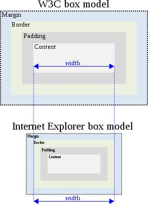

#### Introduction to Modern Web Technologies

[Lea Verou](http://lea.verou.me/2018/02/free-intro-to-web-development-slides-with-demos/) has shared the slides from her MIT labs introducing students to Web development technologies. A great set of slides plus  useful resource selection to go with them.  Lots more good stuff on her wonderfully absorbing Website too.

#### CSS Grid Dev-tools and Implicit vs Explicit Tracks

Two more of Wes Bos [CSS GRID](https://cssgrid.io/) videos.  I'm getting the hang of using npm through Powershell for ```browser-sync```.  Quite a bit of shuffling windows around the desktop and rearranging the dev tools panes, resizing things.

Outlining and changing the colour the lines around items in _web developer>inspector_.  Dotted lines surround implicit tracks, which are like the default ones and dashed lines border explicit tracks which are defined by you in the code.

### Day 3 March 10th 2018 -  Fun with CSS Grid Fundamentals

Second day of the [Wes Bos ](http://wesbos.com/) [CSS GRID](https://cssgrid.io/) course dives right into making and sizing grid items.

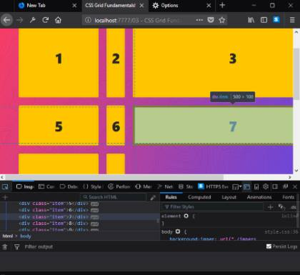


This piece of code demonstrates how ```display: grid;```  works on all the container items,  
```grid-template-columns: 200px 500px;``` and ```grid-template-rows: 200px 100px 400px;``` explicitly sizes the items and 
```grid-gap: 20px;``` sets the tracks, which are like margins between the items.
   

```
    .container {
      display: grid;
      grid-template-columns: 200px auto 500px 50px;
      grid-template-rows: 200px 100px 400px;
      grid-gap: 20px;
    }
``` 
  
The ```auto``` keyword made things fluid and the values are pixels or rems rather than percentages as the new ```fr``` value is going to be introduced instead later on.

### Not everything has to be square!

Sometimes it seems like everything on the Web is a box - it doesn't have to be.

>Use the Clip Path property to alter elements in your layouts to be polygons, circles, triangles, and more. ~ Jen Simmons

In this great video  [Jen Simmons](https://www.youtube.com/watch?v=3kncTIpc4Q4) explains.  There's a whole bunch more about layout on her YouTube Channel [Layout Land](https://www.youtube.com/channel/UC7TizprGknbDalbHplROtag) - just what I need right now.


### Day 2 March 9th 2018 - Griddy Up

After a quick review of last year's coding efforts I decided that I need to improve my CSS skills.  So today I started  
[CSS GRID](https://cssgrid.io/) the 25 video free course by [Wes Bos ](http://wesbos.com/).

>Wes, How is this Free!? What's the Catch?

>No catch! A huge thanks to Mozilla Firefox who has sponsored my time to create this course and offer it up for free. Firefox packs >some of the best dev tools and in particular their CSS Grid Dev tools make understanding, debugging and visualizing complex grid >layouts a snap.

### Starter Files and Tooling Setup

After the welcome video the first tutorial is only a little over 10 minutes, but there is a lot to do!
- Install Firefox Quantum: Developer Edition
- Download and install Node.js
- Download starter files from GitHub
- Download and install VS Code

I already have the Firefox Quantum Developer Browser but I did need to install Node.js.  I followed along with the video pausing it to get through each of the steps required to complete the setup.  I used Windows Powershell to check for the Node.js installation. Next was downloading the starter files from GitHub, I also forked the repo, noting that I should take care not to do a pull request. 

I got VS code up and running and read the opened JSON lock file.  Although this seemed a bit obscure to start with the reason is to have the```"browser-sync"``` tool update the results of coding in the browser without refreshing.

The next part was to look at the start file package in Powershell by copy pasting it into the root and then ```npm i``` which installed the dependency  ```"browser-sync"```.

```npm start``` then opened a page of the files to work with in the browser.

- A nice basic html skeleton file.
With a demonstration of how adjustments automatically refresh.
- An explanatory recommendation and demonstration of Emmet.
```container.item*10``` is a useful snippet. Hit tab = ten divs.
- A run through of the basic CSS stylesheet no CSS Grid here yet.
- ```var(--color)```from ```:root``` top of stylesheet
- Google ```"box-sizing: border-box;"``` 

Loads of tips and snippets in a short video so I'm happy.  Everything worked not exactly straight away but eventually so looking forward to tomorrow.


                                                                                                                  
### Day 1 March 8th 2018 - Mastering Markdown

Last year I coded every day, nearly four rounds of one hundred days of code. As well as tweeting my progress I followed tutorials, got stuck, found answers, read manuals, read code, read blogs, signed up for email newsletters, did MOOCs ... and made this 
website of my own [gipsi.itbit.me blog](http://gipsi.itbit.me).

Today I'm reviewing what I did, tinkering a bit, fixing broken links and setting up some new things for a another round of [#100DaysOfCode](http://www.100daysofcode.com/).

I'm participating in the CodeNewbie Challenge [**Start Coding** #CNC2018](http://2018.codenewbie.org/) which is encouraging me to think more clearly about and be more specific with my coding goals.

### Day 1 February 1st 2018 - delayed start

Partly due to working on:
- Learning about [Biodiversity and Global Change: Science & Action](https://www.class-central.com/course/coursera-biodiversity-and-global-change-science-action-7793) and creative writing [The Craft of Plot](https://www.class-central.com/course/coursera-creative-writing-the-craft-of-plot-5625).
- Setting up the tools for [Creative Programming for Digital Media & Mobile Apps](https://www.mooc-list.com/course/creative-programming-digital-media-mobile-apps-coursera).
- "Doing the Opposite" [#100DaysOfVolunteering](gipsi.github.io/snowtrees_20180227.jpg) as a thing after thinking about [#100DaysOfX](http://www.100daysofx.com/).
- A MOOC about mental health and wellbeing [Psychology and Mental Health: Beyond Nature and Nurture](https://www.futurelearn.com/courses/mental-health-and-well-being).

 _*I am developing this coding blog from a template and intend to keep the following section here for reference:_

## *Welcome to GitHub Pages
 
You can use the [editor on GitHub](https://github.com/gipsi/gipsi.github.io/edit/master/README.md) to maintain and preview the content for your website in Markdown files.

Whenever you commit to this repository, GitHub Pages will run [Jekyll](https://jekyllrb.com/) to rebuild the pages in your site, from the content in your Markdown files.

### Markdown

Markdown is a lightweight and easy-to-use syntax for styling your writing. It includes conventions for

```markdown
Syntax highlighted code block

# Header 1
## Header 2
### Header 3

- Bulleted
- List

1. Numbered
2. List

**Bold** and _Italic_ and `Code` text

[Link](url) and 
```

For more details see [GitHub Flavored Markdown](https://guides.github.com/features/mastering-markdown/).

### Jekyll Themes

Your Pages site will use the layout and styles from the Jekyll theme you have selected in your [repository settings](https://github.com/gipsi/gipsi.github.io/settings). The name of this theme is saved in the Jekyll `_config.yml` configuration file.

### Support or Contact

Having trouble with Pages? Check out our [documentation](https://help.github.com/categories/github-pages-basics/) or [contact support](https://github.com/contact) and we’ll help you sort it out.

