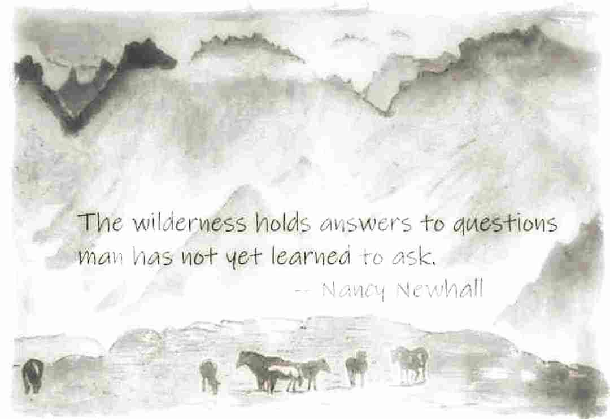
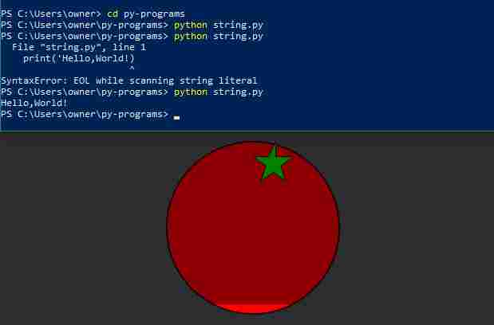
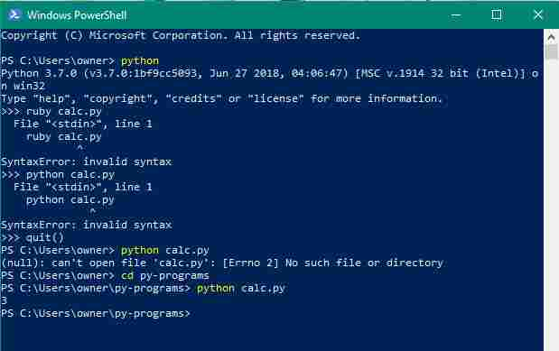

<!--- [comment]: <> (This is a comment, it will not be included) --->

> "There is no problem so bad that you can't make it worse." [Chris Hadfield](https://www.youtube.com/watch?v=GplXBlTNO4A)



# A blog about learning to code

> I think when you have a lot of jumbled up ideas they come together slowly over a period of several years ~ [Tim Berners-Lee](https://en.wikipedia.org/wiki/Tim_Berners-Lee)

## *Welcome to (Gipsi's) GitHub Pages

### 15/10/2018 100DaysofCode Day 6

Updated my new website project with a CSS animated [moon button](https://codepen.io/chriscoyier/pen/GYOQNY) coded by Chris Coyier.  I tried it out with the version I keep on desktop before uploading to neocities.  Also read a some of Rune Madsen's [Programming Design Systems](https://programmingdesignsystems.com/)

### 14/10/2018 100DaysofCode Day 5

I added some CSS to my new neocities website.  [Ground floor](https://groundfloor.neocities.org/text.html) - out-of-the-box styling framework. Reading [The Inner Light Theory of Consciousness: A scientific look at the human mind](http://www.dspguide.com/InnerLightTheory/Main.htm) by Steven W. Smith

### 13/10/2018 100DaysofCode Day 4

My own new [#neocities website](https://neocities.org/site/gipsi) (one hour on an ipad) https://gipsi.neocities.org

### 12/10/2018 100DaysofCode Day 3 
I made an ASCII alpaca with an Android app called [ASCII Cam](https://play.google.com/store/apps/details?id=au.com.darkside.asciicamfree&hl=en_GB).

### 10/10/2018 100DaysofCode Day 2

Creative coding for audio visuals.  Lots of exploring, courses and tutorials for Puredata [Dan Wilcox robotcowboy](https://www.youtube.com/watch?v=P5jE2V5i718&index=2&list=PLFDAFB17FB40E8161) TidalCycles [Yaxu](https://yaxu.org/) Sonic Pi [Sam Aaron](https://sonic-pi.net/).

[Digital signal processing](http://www.dspguide.com/) and
[Digital sound processing tutorial for the brain dead](http://yehar.com/blog/?p=121)

###  09/10/2018 100DaysofCode Day 1
Hacktoberfest: open source [My 6 contributions](https://hacktoberfest.digitalocean.com/stats/gipsi)
Looked at quite a few repos to see what might be useful.  Yesterday I went through about 8 Hugo blog tutorials thinking Of contributing to a website, then decided that was a bit ambitious. So stuck to things I understand.  Like typos, spelling and whitespace.  My confidence in reading and understanding what code is is growing quicker than the writing of it.

---
### stuff explaining this site
 
You can use the [editor on GitHub](https://github.com/gipsi/gipsi.github.io/edit/master/README.md) to maintain and preview the content for your website in Markdown files.

Whenever you commit to this repository, GitHub Pages will run [Jekyll](https://jekyllrb.com/) to rebuild the pages in your site, from the content in your Markdown files.

### Markdown

Markdown is a lightweight and easy-to-use syntax for styling your writing. It includes conventions for

```markdown
Syntax highlighted code block

# Header 1
## Header 2
### Header 3

- Bulleted
- List

1. Numbered
2. List

**Bold** and _Italic_ and `Code` text

[Link](url) and 

```

For more details see [GitHub Flavored Markdown](https://guides.github.com/features/mastering-markdown/).

### Jekyll Themes

Your Pages site will use the layout and styles from the Jekyll theme you have selected in your [repository settings](https://github.com/gipsi/gipsi.github.io/settings). The name of this theme is saved in the Jekyll `_config.yml` configuration file.

### Support or Contact

Having trouble with Pages? Check out our [documentation](https://help.github.com/categories/github-pages-basics/) or [contact support](https://github.com/contact) and we’ll help you sort it out.

<!--
> 

Links: to [@codewisdom](https://twitter.com/CodeWisdom) on Twitter, and about
[Nicholas Negroponte](https://en.wikipedia.org/wiki/Nicholas_Negroponte) at Wikipedia.

-->

### Old stuff

## #[100DaysofCode Journal](100daysofcodelog.md) - Restart - Round Five

**[@gipsitana on Twitter](https://twitter.com/gipsitana)** 

## HTML/CSS/JavaScript ... and Python

### Current coding interests: web development, machine learning and data science

#### Sunday 5th August 2018
#### #100daysofcode R5D22
#### #1mwtt #summerofcode D22

#### Weekly review

This Summer of Code is covering a lot of ground and I have to decide what not to do to keep up.  The hot weather came back on Monday and my brain doesn't feel up to thinking and focusing so although I've tinkered a little every day I reserved most of the 'homework' for the weekend.  

Walking is more comfortable than sitting still on the hottest days and it was good to go to the seaside and watch a great barge full of rock arrive from Cornwall.  Seagulls and children splashing in waves swooshing through pebbles, the chug of a fishing boat and the squeal of fairground riders, a cool salt breeze soundscape.

Watching the video lectures and thinking about it works well for me then going back and doing the code.  I have to stop the videos till I get everything to work and although I still haven't finished day 1 of week 3 it feels like a breakthrough in 'getting it'.  

## Lexical diversity

Today's [Jupyter code notes](https://github.com/gipsi/summer-of-code/blob/master/wk3-d1-ch0-01.ipynb)

 ### Links:

[The human insights missing from big data, Ted Talk by Tricia Wiang](https://www.youtube.com/watch?v=pk35J2u8KqY)

>   On Day 4  @ilonabudapesti dropped 'big data is just junk' this talk explains how:
[How small are our big data](https://www.youtube.com/watch?v=y65n0WEZ6KY&index=16&list=PL940Wy-AWgfalgaKa7e2iSECkQgK8oCO8)

#### #100daysofcode R5D18/21
#### #1mwtt #summerofcode D18/21

> The concept of input and output where you input then check/test the output.

>  Python has powerful, smooth, fast, foreloops.

### NLTK modules: like - which car you want to drive?

Machine learning built in

Tokenisation: breaking big text into words etc...

20 hours per chapter of NLP book


#### #100daysofcode R5D14/17
#### #1mwtt #summerofcode D14/17

## Concordance, similarity and dispersion plots

Installed numpy and matplotlib with pip in powershell. I found this after skimming through quite a few docs about installing python modules with pip ```python -m pip install --user numpy matplotlib``` at  [scipy.org](https://scipy.org/install.html)

Today's code in [Jupyter notebook](https://github.com/gipsi/summer-of-code/blob/master/wk3-d1-ch1.ipynb)

#### #100daysofcode R5D13
#### #1mwtt #summerofcode D13

## Real programming:

"Is testing out what you write to see if it behaves the way you want." Ilona Budapesti

[Today's code](https://github.com/gipsi/summer-of-code/blob/master/wk3-d1.ipynb)


#### #100daysofcode R5D12
#### #1mwtt #summerofcode D12

## NLTK Python and NLP - Natural language processing

I like to watch the tutorial videos and absorbing the concepts before coding along.  This weekend particularly I found that
getting setup and ready with the tools makes it easier to focus on the code.

#### Link:
[Single source of truth](https://en.wikipedia.org/wiki/Single_source_of_truth)

 
#### #100daysofcode R5D11
#### #1mwtt #summerofcode D11

## Install Fest weekend

### Pip, Jupyter notebook and NLTK

Sunday 29th July, 2018

#### The weather

I started this install fest on Friday as 50 days of heatwave finally broke down with  [mammatus](https://aviation.stackexchange.com/questions/30484/why-is-the-mammatus-cloud-formation-so-dangerous) storm clouds blanketing the sky and effectively concealing the [lunar eclipse](https://en.wikipedia.org/wiki/July_2018_lunar_eclipse). The eclipse occurred simultaneously with the [perihelic opposition of Mars](https://en.wikipedia.org/wiki/Orbit_of_Mars#Oppositions), a coincidence that happens once every 25,000 years.

Now (by Sunday lunchtime) it's raining steadily on a cool Atlantic wind, trees are flinging great drips against the windows and noisy magpies sound annoyed.

#### Modules and packages

How to access code that you saved in other files.

[Three ways to import modules](https://github.com/gipsi/summer-of-code/blob/master/wk2-d4.py)

Sharing:

[Installing Python Modules](https://docs.python.org/3/installing/index.html#basic-usage)


#### The Install Fest

##### Tab proliferation - Me too!

Ilona Budapesti's remark sums up well the theme of this weekend [#SummerOfCode](https://www.youtube.com/watch?v=5siljHaRF64) project.

- ```pip	``` [pip installs packages](https://pypi.org/project/pip/)
- [Jupyter Notebook](http://jupyter-notebook-beginner-guide.readthedocs.io/en/latest/what_is_jupyter.html)
- [NLTK](http://www.nltk.org/) natural language toolkit

I opened so many tabs getting this lot to work, learning much about  navigation, deciphering errors whilst trying to keep things light and simple.  When given the choice I decided to go with the ```pip``` installation route for the Jupyter notebook rather than downloading Anaconda.  This means I payed more attention to file paths which is something I'm still keeping an eye on and indeed there were some issues when trying to access NLTK in Jupyter.   Lots of practice with the command line - terminal - bash - shell - prompt, watching videos confirms it's not just me who cant decide what to call it.

#### Link:

[Pythonic perambulations.  Installing python packages from a Jupyter notebook](https://jakevdp.github.io/blog/2017/12/05/installing-python-packages-from-jupyter/)

# Hello, 99 Bottles!
## #100daysofCode R5D10
## #1mwtt #SummerofCode D10

## Programming notes 

```
# I don't know the 99 bottles song
# I know the 10 green bottles one

# look it up

# http://www.99-bottles-of-beer.net/

# for quant in range(00, 0, -1):
#    if quant > 1:
#       print (quant, "bottles of beer on the wall,", quant, "bottles of beer.")
#       if quant > 2:
#          suffix = str(quant - 1) + " bottles of beer on the wall."
#       else:
# 	     suffix = "1 bottle of beer on the wall."
# 	elif quant == 1:
# 	   print ("1 bottle of beer on the wall, 1 bottle of beer.")
# 	   suffix = 'no more beer on the wall!'
# 	print ("Take one down, pass it around,", suffix)
# 	print ("--")
	
# nope python 2 - tried to convert but:

# TabError: inconsistent use of tabs and spaces in indentation - line 235

# https://rosettacode.org/wiki/99_Bottles_of_Beer/Python#Using_a_generator_expression_.28Python_3.29

# This code worked when I got the spacing right!
 
def sing(b, end):
    print(b or 'No more','bottle'+('s' if b-1 else ''), end)
 
for i in range(99, 0, -1):
    sing(i, 'of beer on the wall,')
    sing(i, 'of beer,')
    print('Take one down, pass it around,')
    sing(i-1, 'of beer on the wall.\n')
	
# the "Hello World" of programming paradigms
```
### 99 bottles in computer science

> The [computer scientist](https://en.wikipedia.org/wiki/Computer_scientist) [Donald Knuth](https://en.wikipedia.org/wiki/Donald_Knuth) proved that the song has a [complexity](https://en.wikipedia.org/wiki/Time_complexity) of                         O         (         log         ⁡         N         )                 {\displaystyle O(\log N)}     in his [in-joke](https://en.wikipedia.org/wiki/In-joke)-article "[The Complexity of Songs](https://en.wikipedia.org/wiki/The_Complexity_of_Songs)". 

> Numerous computer programs exist to output the lyrics to the song. This is analogous to ["Hello, World!" programs](https://en.wikipedia.org/wiki/%22Hello,_World!%22_program), with the addition of a [loop](https://en.wikipedia.org/wiki/Control_flow#Loops).  As with "Hello World!", this can be a practice exercise for those  studying computer programming, and a demonstration of different [programming paradigms](https://en.wikipedia.org/wiki/Programming_paradigm) dealing with looping constructs and syntactic differences between programming languages within a paradigm. 

> 
>
> The program has been written in over 1500 different programming languages.[[6\]](https://en.wikipedia.org/wiki/99_Bottles_of_Beer#cite_note-6) 

> A simple example using classical [BASIC](https://en.wikipedia.org/wiki/BASIC) syntax: 

```
FOR Bottle = 100 TO 1 STEP -1
 PRINT STR(Bottle) +" bottles of beer on the wall, "+ STR(Bottle) +" bottles of beer"
 PRINT "Take one down and pass it around, "+ STR(Bottle-1) +" bottles of beer on the wall"
NEXT Bottle
```
ref:   [wikipedia](https://en.wikipedia.org/wiki/99_Bottles_of_Beer)

### links:

- [99 bottles of beer: one program in 1500 variations](http://www.99-bottles-of-beer.net/)
- [99 bottles of beer: Rosetta code](https://rosettacode.org/wiki/99_Bottles_of_Beer)
- [99 bottles of beer test](https://en.wikipedia.org/wiki/Wikipedia:99_Bottles_of_Beer_test)
- The FizzBuzz test and [Why can't programmers.. program](https://blog.codinghorror.com/why-cant-programmers-program/)
- [Programming Puzzles & Code Golf](https://codegolf.stackexchange.com/questions/2/99-bottles-of-beer)

# More Loops .
## #100daysofCode R5D8/9
## #1mwtt #SummerofCode D8/9 
Caught up with the SOC video lectures, Friday's one was a surprise and very uplifting.
Not much time left to code but I did do some tinkering with a while loop, quotes and escape character.


## Coding more
## #100daysofCode R5D7
## #1mwtt #SummerofCode  D7
Watched the SOC replay for yesterday then updated the GitHub ToolKitten fork and went back to Day four lecture to follow along with the loop and while loop and break statement coding.  I lost some code in the editor, not sure how and after following along with the no copy pasting rule it feels like I'm going slow.  Still nothing seems to work first time.  I have to check and check again.  I even got into an infinite loop of zeros in the shell which flustered me a bit but the computer didn't blow up, I exited the shell with the x in the top right corner, rebooted python and everything was fine again.

[My day 4 code lesson notes in a python file](https://github.com/gipsi/summer-of-code/blob/master/wk1-d4.py)

### Links:

- [A-seven-step-approach-to-solving-programming-problems](https://www.coursera.org/lecture/duke-programming-web/a-seven-step-approach-to-solving-programming-problems-AEy5M)
- [Dont-be-a-junior-developer-the-roadmap](https://hackernoon.com/dont-be-a-junior-developer-the-roadmap-9fde5cf384bb)

## Coding more
## #100daysofCode R5D6
## #1mwtt #SummerofCode  D6

Learning #python the hard way 
### #CNC2018 Code More 
Mission 3 Sorting out the times and workspace where I can focus and code best.

[myspace-coding-legacy](https://news.codecademy.com/myspace-coding-legacy/)

## Error messages are my friends


## #100daysofCode R5D5
## #1mwtt #SummerofCode  D5

Carefuly went through what I learned in this weeks lessons and wrote some python code:
```
  name1 = input('Enter your first name: ')
  name2 = input('Enter your middle name: ')
  name3 = input('Enter your last name: ')
  print('Hello', name1 + ' ' + name2 + ' ' + name3)
```
```
  bestnumber = input('Enter your favourite number: ')
  print('Perhaps a better number is?', int(bestnumber) + 1)
```
Started using the interpreter ```>>>``` as well as ```print()``` from file

## #100daysofCode R5D4
Made css-grid repo for watercolour painting challenge.
[waterpaint2018](https://gipsi.github.io/waterpaint2018/)
## #1mwtt #SummerofCode  D4
Revisiting some of [Learn to program](https://pine.fm/LearnToProgram/chap_00.html) by Chris Pine
and the sweetness of some #python [syntactic sugar](https://en.wikipedia.org/wiki/Syntactic_sugar).

## #100daysofCode R5D3
## #1mwtt #SummerofCode  D3 

Loops and arrays, if and sorted.

The year 2038 problem

Arithmetical calculations, integer overflow and the end of time. 

A new GitHub repo for my Summer of Code DIY notes.

Discord yay!

Practicing ```python calc.py``` in the command line. 

Gamification for non-profits.

## #100daysofCode R5D2
## #1mwtt #SummerofCode  D2
Watched Video lecture about combining strings and numbers, assigning values to variables


 
## #100daysofCode R5D1
## #1mwtt #SummerofCode  D1

I took summer break when I got to halfway through round 5 day 50ish of coding every day and have been focussing on making art.  Digital images with an Android phone camera, photo editor, Pixl andr Pixabay through May and June and watercolour painting in July.  I post the stuff I do on [Instagram](https://www.instagram.com/gipsitana/).

## CNC2018 Code More

I've been structuring the way I think about coding, planning a website with the second CodeNewbie challenge this year.
I've started a plan with an html document in Notepad++.  Yesterday I started learning Trello boards.

> "The hardest part of coding more isn’t the coding — it’s finding a system and structure that fits into your busy life. We’ll help you set goals, create a roadmap, find a schedule, and, most importantly, hold you accountable to reaching your coding goals."

## One million women to tech - DIY track

I missed the onboarding during a sultry heatwave World Cup weekend but managed to navigate through Facebook groups, Twitter, Youtube and emails to watch a replay of the webinar.  Inspired I caught up with the first weeks lessons by Tuesday night. So here I am Wednesday afternoon feeling chuffed at getting Python to do a calculation on my laptop in Powershell!  



The transcript of the lessons here on GitHub is great but I did get stuck when python wasn't recognised in Powershell or the Windows basic command prompt.  After some unfruitful Python help pages and stackoverflow searching I skipped ahead to [Learn Python the HardWay](https://learnpythonthehardway.org/python3/ex0.html) which I know has thorough installation guide for newbs. Indeed I had to uninstall and start again, this time checking the PATH box which I'd left unchecked. Cool! Python was summoned in the shell. However my calc.py file still didn't work. This time the [Python FAQ's](https://docs.python.org/3/faq/windows.html) helped and I sorted out the file address.  I moved the py-programs and web-projects folders from the desktop to the users folder and cd'd to py-programs.

Note! The prompt ruby is a nice little tip about lessons origins of [Learn to program](https://pine.fm/LearnToProgram/) adapted for Python from Ruby. 


